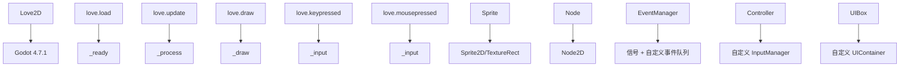
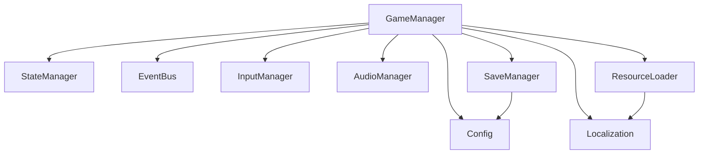
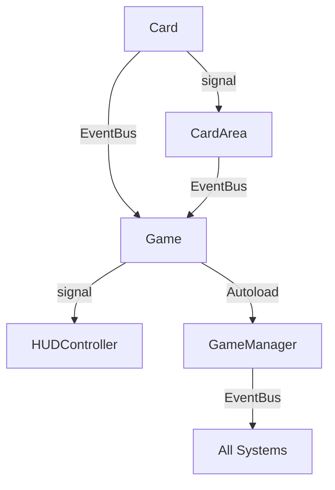

**测试完成，继续阶段一分析**

---

## ✅ **三、环境确认结果**

### tool/godotexe headless 模式测试

**测试命令：**
```bash
/home/user/balabala-godot4.7.1/tool/godotexe/godot --headless --version
```

**测试结果：**
- ✅ **正常启动**：成功输出版本 `4.7.1.stable.official.a13da4feb`
- ✅ **GDScript 检查**：可执行 GDScript 语法检查（需要继承 SceneTree 或 MainLoop）
- ✅ **headless 模式**：完全支持 `--headless` 参数

---

---

# 📋 **Balatro Love2D 重制版 → Godot 4.7.1 迁移完整规划方案**

---

## **A. balatro src 项目分析**

---

### **A.1 项目目录结构概览**

```
balabala src/
├── Balabala(从balabala.exe解压而来)/
│   ├── main.lua                          # Love2D 入口文件，回调函数定义
│   ├── game.lua                          # 游戏核心逻辑（3600+行），状态机、卡牌、回合管理
│   ├── globals.lua                       # 全局变量、常量、配置定义
│   ├── card.lua                          # 卡牌类定义、属性、行为逻辑
│   ├── cardarea.lua                      # 卡牌区域管理（手牌、牌库、弃牌等）
│   ├── blind.lua                         # Blind（盲注）系统
│   ├── back.lua                          # 牌背系统
│   ├── tag.lua                           # 标签系统
│   ├── challenges.lua                    # 挑战模式定义
│   ├── conf.lua                          # 配置文件
│   ├── version.jkr                       # 版本信息
│   │
│   ├── engine/                           # 引擎层模块
│   │   ├── object.lua                    # 基础对象类（类继承系统）
│   │   ├── node.lua                      # 节点系统（位置、大小、容器）
│   │   ├── moveable.lua                  # 可移动对象（拖拽、碰撞、动画）
│   │   ├── sprite.lua                    # 精灵渲染
│   │   ├── animatedsprite.lua           # 动画精灵
│   │   ├── controller.lua                # 输入控制器（鼠标、键盘、手柄）
│   │   ├── event.lua                     # 事件系统
│   │   ├── ui.lua                        # UI 基础组件
│   │   ├── text.lua                      # 文本渲染
│   │   ├── particles.lua                 # 粒子系统
│   │   ├── sound_manager.lua             # 音频管理（多线程）
│   │   ├── save_manager.lua              # 存档管理（多线程）
│   │   ├── http_manager.lua              # HTTP 通信
│   │   ├── string_packer.lua             # 字符串压缩
│   │   └── profile.lua                   # 配置文件管理
│   │
│   ├── functions/                        # 功能层模块
│   │   ├── UI_definitions.lua            # UI 组件定义
│   │   ├── button_callbacks.lua          # 按钮回调函数
│   │   ├── common_events.lua             # 公共事件处理
│   │   ├── state_events.lua              # 状态事件
│   │   ├── misc_functions.lua            # 杂项函数
│   │   └── test_functions.lua            # 测试函数
│   │
│   ├── localization/                     # 本地化文件（15种语言）
│   │   ├── en-us.lua, zh_CN.lua, zh_TW.lua, ja.lua, ...
│   │
│   └── resources/                        # 资源文件
│       ├── fonts/                        # 字体文件（8种）
│       ├── sounds/                       # 音效文件（100+个 ogg）
│       ├── shaders/                      #着色器（25+个 .fs 文件）
│       └── textures/                     # 纹理图集
│           ├── 1x/, 2x/                  # 不同分辨率
│           ├── cards_1.png, cards_2.png  # 卡牌图集
│           ├── Jokers.png, Tarots.png     # Joker、Tarot 图集
│           ├── ui_assets.png              # UI 资源
│           └── collabs/                   # 合作图集
│
└── [DLL 文件]                            # Love2D 依赖库
```

---

### **A.2 主要模块职责**

| **模块** | **职责** | **行数** | **复杂度** | **迁移难度** |
|----------|----------|----------|------------|--------------|
| `main.lua` | Love2D 入口，定义 `love.load`/`update`/`draw` 等回调 | 389 | 中 | ⭐⭐ |
| `game.lua` | **核心游戏逻辑**，包含状态机、回合流程、卡牌管理、UI 管理 | 3630+ | 高 | ⭐⭐⭐⭐⭐ |
| `globals.lua` | **全局变量定义**，颜色、配置、枚举、常量 | 523 | 中 | ⭐⭐ |
| `card.lua` | **卡牌类**，定义卡牌属性、行为、渲染、交互 | 242KB | 高 | ⭐⭐⭐⭐ |
| `cardarea.lua` | **卡牌区域管理**，手牌、牌库、弃牌堆、Joker 区域等 | - | 中 | ⭐⭐⭐ |
| `blind.lua` | **盲注系统**，Boss 战、奖励计算 | - | 中 | ⭐⭐⭐ |
| `back.lua` | **牌背系统**，解锁、切换牌背 | - | 低 | ⭐⭐ |
| `tag.lua` | **标签系统**，影响游戏机制 | - | 中 | ⭐⭐⭐ |
| `challenges.lua` | **挑战模式**，特殊规则 | - | 中 | ⭐⭐⭐ |
| `engine/object.lua` | **基础类系统**，实现 Lua 的类继承 | - | 低 | ⭐⭐ |
| `engine/node.lua` | **节点系统**，位置、大小、容器关系 | - | 中 | ⭐⭐ |
| `engine/moveable.lua` | **可移动对象**，拖拽、碰撞、动画 | - | 中 | ⭐⭐⭐ |
| `engine/controller.lua` | **输入系统**，鼠标/键盘/手柄 | - | 高 | ⭐⭐⭐⭐ |
| `engine/event.lua` | **事件系统**，延迟执行、优先级 | - | 中 | ⭐⭐⭐ |
| `engine/ui.lua` | **UI 系统**，UIBox、UIElement 基础类 | - | 高 | ⭐⭐⭐⭐ |
| `engine/sound_manager.lua` | **音频管理**，多线程播放 | - | 中 | ⭐⭐⭐ |
| `engine/save_manager.lua` | **存档管理**，多线程保存/加载 | - | 中 | ⭐⭐⭐ |

---

### **A.3 程序入口与主循环结构**

#### **Love2D 生命周期**
```lua
-- main.lua
function love.load()      -- 初始化：加载资源、设置窗口、启动各管理器
function love.update(dt)   -- 更新：游戏逻辑、动画、输入处理
function love.draw()      -- 渲染：绘制所有对象
function love.keypressed() -- 键盘输入
function love.mousepressed() -- 鼠标输入
function love.gamepadpressed() -- 手柄输入
function love.resize(w, h) -- 窗口 resize
function love.quit()       -- 退出清理
```

#### **游戏状态机（game.lua）**
```lua
G.STATES = {
    SELECTING_HAND = 1,    -- 选择手牌
    HAND_PLAYED = 2,       -- 手牌已出
    DRAW_TO_HAND = 3,      -- 抽牌到手牌
    GAME_OVER = 4,         -- 游戏结束
    SHOP = 5,              -- 商店
    PLAY_TAROT = 6,        -- 使用 Tarot
    BLIND_SELECT = 7,      -- 选择盲注
    ROUND_EVAL = 8,        -- 回合评分
    TAROT_PACK = 9,        -- Tarot 卡包
    PLANET_PACK = 10,      -- 行星卡包
    MENU = 11,             -- 菜单
    TUTORIAL = 12,         -- 教程
    SPLASH = 13,          -- 启动画面
    SANDBOX = 14,         -- 沙盒模式
    SPECTRAL_PACK = 15,    -- 幽灵卡包
    DEMO_CTA = 16,        -- Demo CTA
    STANDARD_PACK = 17,    -- 标准卡包
    BUFFOON_PACK = 18,     -- 小丑卡包
    NEW_ROUND = 19,       -- 新回合
}
```

#### **主循环流程**
```
love.load() → G:start_up() → G:splash_screen()
    ↓
G:main_menu() → 用户选择 → G:start_run()
    ↓
G:prep_stage(RUN, BLIND_SELECT) → 选择盲注
    ↓
G:prep_stage(RUN, DRAW_TO_HAND) → 抽牌
    ↓
G:prep_stage(RUN, SELECTING_HAND) → 选择手牌出牌
    ↓
G:prep_stage(RUN, HAND_PLAYED) → 计算得分
    ↓
G:prep_stage(RUN, ROUND_EVAL) → 回合评分
    ↓
G:prep_stage(RUN, SHOP) → 商店购买
    ↓
循环至 GAME_OVER 或 继续下一回合
```

---

### **A.4 UI、卡牌逻辑、状态管理、资源管理的组织方式**

#### **UI 组织方式**
- **UIBox 系统**：树形结构，支持嵌套、对齐、偏移
- **UIElement**：基础 UI 单元（文本、按钮、图像）
- **DynaText**：动态文本，支持渐入渐出、颜色变化
- **UI 定义**：在 `functions/UI_definitions.lua` 中集中定义
- **回调绑定**：在 `functions/button_callbacks.lua` 中定义

#### **卡牌逻辑组织**
```lua
-- card.lua
Card = Object:extend()  -- 基础卡牌类
function Card:init(x, y, w, h, card_proto, center_proto)
    -- 初始化卡牌属性
end
function Card:calculate_joker(...)  -- Joker 效果计算
function Card:start_dissolve(...)  -- 溶解动画
function Card:start_materialize(...) -- 显形动画
```

#### **状态管理**
- **全局状态**：`G.STATE` 控制整体流程
- **事件系统**：`EventManager` 管理延迟事件、动画、回调
- **状态切换**：通过 `G:prep_stage()` 切换场景和状态

#### **资源管理**
- **纹理图集**：`ASSET_ATLAS` 存储所有图集
- **着色器**：`SHADERS` 存储所有着色器对象
- **音频**：`SOURCES` 存储音效文件路径
- **字体**：`FONTS` 存储字体对象
- **多线程加载**：音频、存档、HTTP 使用线程异步处理

---

### **A.5 Love2D → Godot 映射分析**

| **Love2D 概念** | **Godot 对应** | **映射说明** | **迁移难度** |
|-----------------|----------------|--------------|--------------|
| `love.load()` | `_ready()` | 场景初始化 | ⭐⭐ |
| `love.update(dt)` | `_process(dt)` | 更新逻辑 | ⭐⭐ |
| `love.draw()` | `_draw()` | 渲染逻辑 | ⭐⭐ |
| `love.keypressed()` | `_input(event)` | 输入处理 | ⭐⭐⭐ |
| `love.mousepressed()` | `_input(event)` | 鼠标输入 | ⭐⭐⭐ |
| `Sprite` | `Sprite2D` 或 `TextureRect` | 精灵渲染 | ⭐⭐ |
| `Node` | `Node2D` | 节点系统 | ⭐⭐ |
| `Moveable` | 自定义 `Moveable` 类 | 可移动对象 | ⭐⭐⭐ |
| `CardArea` | 自定义 `CardArea` 场景 | 卡牌区域 | ⭐⭐⭐⭐ |
| `UIBox` | 自定义 `UIBox` 场景 | UI 容器 | ⭐⭐⭐⭐ |
| `EventManager` | Godot 信号系统 + 自定义事件队列 | 事件管理 | ⭐⭐⭐ |
| `Controller` | `_input()` + 自定义输入管理器 | 输入系统 | ⭐⭐⭐⭐ |
| `SOURCES` | `AudioStreamPlayer` | 音频播放 | ⭐⭐⭐ |
| `SHADERS` | `ShaderMaterial` |着色器 | ⭐⭐⭐ |
| 线程系统 | Godot 线程 (`Thread`) | 多线程 | ⭐⭐⭐⭐ |
| `love.graphics` | `CanvasItem` + `Drawing` API | 绘制 API | ⭐⭐⭐ |

---

### **A.6 哪些模块适合直接映射，哪些需要重构**

#### **✅ 可直接映射的模块**
| **模块** | **Godot 对应** | **说明** |
|----------|----------------|----------|
| `object.lua` | Godot 类系统 | 使用 `class_name` 或直接类定义 |
| `node.lua` | `Node2D` | 位置、大小、容器关系 |
| `sprite.lua` | `Sprite2D` | 精灵渲染 |
| `animatedsprite.lua` | `AnimatedSprite2D` | 动画精灵 |
| `event.lua` | 信号 + 自定义事件队列 | 事件驱动 |
| `particles.lua` | `GPUParticles2D` | 粒子系统 |
| `text.lua` | `Label` 或 `RichTextLabel` | 文本渲染 |

#### **⚠️ 需要重构的模块**
| **模块** | **重构原因** | **Godot 方案** |
|----------|--------------|----------------|
| `controller.lua` | Love2D 输入系统与 Godot 不同 | 使用 `_input()` + 自定义输入映射 |
| `sound_manager.lua` | 线程模型不同 | 使用 Godot 的 `AudioStreamPlayer` + `Thread` |
| `save_manager.lua` | 线程 + 文件系统 API 不同 | 使用 Godot 的 `FileAccess` + `Thread` |
| `http_manager.lua` | 网络 API 不同 | 使用 Godot 的 `HTTPRequest` |
| `ui.lua` | Love2D 绘制 API 与 Godot 不同 | 使用 Godot 的 `Control` 节点 |
| `cardarea.lua` | 基于 Love2D 的自定义渲染 | 使用 Godot 的 `Node2D` + 自定义排列逻辑 |

#### **🔄 需要架构重新设计的模块**
| **模块** | **问题** | **重构方案** |
|----------|----------|--------------|
| `game.lua` | **巨型文件**（3600+行），耦合严重 | 拆分为多个独立系统 |
| 全局变量 `G` | 全局状态混乱 | 使用 Autoload + 事件总线 |
| 状态机 | 硬编码状态切换 | 使用 Godot 状态模式 |
| 卡牌渲染 | 基于 Love2D 的 Canvas | 使用 Godot 的 `TextureRect` + 着色器 |

---

## **B. Godot 迁移总体方案**

---

### **B.1 从 Love2D 到 Godot 的映射关系**

#### **核心概念映射**



#### **数据结构映射**

| **Love2D** | **Godot** | **说明** |
|------------|-----------|----------|
| `G.STATE` | `GameStateManager.state` | 当前游戏状态 |
| `G.STAGE` | `GameStateManager.stage` | 当前阶段（菜单/游戏/沙盒） |
| `G.P_CARDS` | `CardPrototypes` (Resource) | 卡牌原型数据 |
| `G.P_CENTERS` | `CenterPrototypes` (Resource) | Joker/Tarot/Planet 等原型 |
| `G.P_BLINDS` | `BlindPrototypes` (Resource) | 盲注原型 |
| `G.CONTROLLER` | `InputManager` (Autoload) | 输入管理 |
| `G.E_MANAGER` | `EventBus` (Autoload) | 事件总线 |
| `G.SOUND_MANAGER` | `AudioManager` (Autoload) | 音频管理 |
| `G.SAVE_MANAGER` | `SaveManager` (Autoload) | 存档管理 |

---

### **B.2 建议采用的 Godot 项目层级设计**

```
balabala-godot/
├── project.godot                    # Godot 项目文件
├── .gitignore
│
├── addons/                         # 插件目录
│
├── assets/                         # 原始资源文件（不直接引用）
│   ├── fonts/
│   ├── sounds/
│   ├── shaders/
│   └── textures/
│
├── resources/                      # Godot 资源目录
│   ├── cards/                      # 卡牌资源
│   │   ├── prototypes.res          # 卡牌原型数据
│   │   └── textures/               # 卡牌纹理
│   ├── centers/                    # Joker/Tarot/Planet 等
│   │   └── prototypes.res
│   ├── blinds/                     # 盲注数据
│   │   └── prototypes.res
│   ├── localization/               # 本地化
│   │   └── translations/           # .po 或 .res 文件
│   ├── audio/                      # 音频资源
│   │   ├── sounds/                 # AudioStream 资源
│   │   └── music/                  # 背景音乐
│   ├── shaders/                    # Godot 着色器
│   │   └── *.shader
│   └── themes/                     # UI 主题
│
├── scenes/                         # 场景目录
│   ├── main.tscn                   # 主场景（根）
│   ├── splash/
│   │   └── splash.tscn             # 启动画面
│   ├── menu/
│   │   ├── main_menu.tscn          # 主菜单
│   │   ├── settings.tscn           # 设置界面
│   │   └── deck_select.tscn        # 牌背选择
│   ├── game/
│   │   ├── game_root.tscn          # 游戏根场景
│   │   ├── round/
│   │   │   ├── round.tscn           # 回合场景
│   │   │   └── hand_selection.tscn # 手牌选择
│   │   ├── shop/
│   │   │   └── shop.tscn           # 商店场景
│   │   ├── blind_select/
│   │   │   └── blind_select.tscn   # 盲注选择
│   │   ├── round_eval/
│   │   │   └── round_eval.tscn     # 回合评分
│   │   └── game_over/
│   │       └── game_over.tscn      # 游戏结束
│   ├── ui/
│   │   ├── hud.tscn                # HUD
│   │   ├── card.tscn               # 卡牌预制体
│   │   ├── joker.tscn              # Joker 预制体
│   │   ├── tarot.tscn              # Tarot 预制体
│   │   ├── button.tscn             # 按钮预制体
│   │   └── dialog.tscn             # 对话框预制体
│   └── sandbox/
│       └── sandbox.tscn           # 沙盒模式
│
├── scripts/                        # 脚本目录
│   ├── autoload/                   # Autoload 脚本
│   │   ├── game_manager.gd         # 游戏全局管理器
│   │   ├── state_manager.gd        # 状态管理器
│   │   ├── event_bus.gd            # 事件总线
│   │   ├── input_manager.gd        # 输入管理器
│   │   ├── audio_manager.gd        # 音频管理器
│   │   ├── save_manager.gd         # 存档管理器
│   │   ├── resource_loader.gd      # 资源加载器
│   │   ├── localization.gd         # 本地化管理器
│   │   └── config.gd               # 配置管理器
│   │
│   ├── core/                       # 核心系统
│   │   ├── game.gd                 # 游戏主逻辑（从 game.lua 迁移）
│   │   ├── card.gd                 # 卡牌类
│   │   ├── card_area.gd            # 卡牌区域类
│   │   ├── blind.gd                # 盲注类
│   │   ├── back.gd                 # 牌背类
│   │   ├── tag.gd                  # 标签类
│   │   └── challenge.gd            # 挑战类
│   │
│   ├── systems/                    # 子系统
│   │   ├── round_system.gd        # 回合系统
│   │   ├── hand_system.gd          # 手牌系统
│   │   ├── scoring_system.gd       # 计分系统
│   │   ├── shop_system.gd          # 商店系统
│   │   ├── animation_system.gd     # 动画系统
│   │   └── tutorial_system.gd      # 教程系统
│   │
│   ├── ui/                         # UI 脚本
│   │   ├── ui_manager.gd           # UI 管理器
│   │   ├── hud_controller.gd       # HUD 控制器
│   │   ├── menu_controller.gd      # 菜单控制器
│   │   ├── shop_controller.gd      # 商店控制器
│   │   └── card_ui.gd              # 卡牌 UI
│   │
│   ├── utils/                      # 工具函数
│   │   ├── math_utils.gd           # 数学工具
│   │   ├── table_utils.gd          # 表格工具
│   │   ├── string_utils.gd         # 字符串工具
│   │   ├── color_utils.gd          # 颜色工具
│   │   └── easing.gd               # 缓动函数
│   │
│   └── editor/                     # 编辑器脚本
│       └── project_generator.gd    # 项目骨架生成器
│
├── tools/                          # 外部工具
│   └── godotexe/                   # Godot 可执行文件
│
└── data/                           # 数据文件（JSON/RES）
     ├── cards.json                 # 卡牌数据
     ├── centers.json               # Joker/Tarot 数据
     ├── blinds.json                # 盲注数据
     ├── tags.json                  # 标签数据
     └── challenges.json             # 挑战数据
```

---

### **B.3 哪些系统应该做成场景，哪些应该做成纯脚本/资源对象**

#### **🎭 应该做成场景的系统**

| **系统** | **场景文件** | **原因** |
|----------|--------------|----------|
| 主菜单 | `main_menu.tscn` | 复杂的 UI 层级 |
| 游戏界面 | `game_root.tscn` | 包含多个子场景 |
| 商店 | `shop.tscn` | 独立的交互界面 |
| 盲注选择 | `blind_select.tscn` | 独立的选择界面 |
| 回合评分 | `round_eval.tscn` | 独立的展示界面 |
| 游戏结束 | `game_over.tscn` | 独立的结算界面 |
| HUD | `hud.tscn` | 实时更新的 UI |
| 卡牌 | `card.tscn` | 预制体，可实例化 |
| Joker | `joker.tscn` | 预制体，可实例化 |
| Tarot/Planet | `consumeable.tscn` | 预制体 |

#### **📜 应该做成纯脚本的系统**

| **系统** | **脚本文件** | **原因** |
|----------|--------------|----------|
| 游戏状态管理 | `state_manager.gd` | 全局状态，不需要场景 |
| 事件总线 | `event_bus.gd` | 全局事件分发 |
| 输入管理 | `input_manager.gd` | 全局输入处理 |
| 音频管理 | `audio_manager.gd` | 全局音频控制 |
| 存档管理 | `save_manager.gd` | 全局数据持久化 |
| 资源加载 | `resource_loader.gd` | 全局资源管理 |
| 本地化 | `localization.gd` | 全局文本管理 |
| 配置管理 | `config.gd` | 全局配置 |

#### **🗃️ 应该做成资源对象的系统**

| **系统** | **资源类型** | **原因** |
|----------|--------------|----------|
| 卡牌原型 | `Resource` | 数据驱动，可编辑 |
| Joker 原型 | `Resource` | 数据驱动 |
| Tarot 原型 | `Resource` | 数据驱动 |
| 盲注原型 | `Resource` | 数据驱动 |
| 标签原型 | `Resource` | 数据驱动 |
| 挑战原型 | `Resource` | 数据驱动 |
| 颜色配置 | `Resource` | 全局颜色常量 |
| 字体配置 | `Resource` | 字体管理 |

---

### **B.4 是否需要 Autoload，以及建议挂哪些全局管理器**

#### **✅ 建议 Autoload 列表**

| **Autoload 名称** | **脚本文件** | **职责** | **依赖** |
|------------------|--------------|----------|----------|
| `GameManager` | `scripts/autoload/game_manager.gd` | 游戏全局状态、生命周期管理 | 无 |
| `StateManager` | `scripts/autoload/state_manager.gd` | 状态机管理 | GameManager |
| `EventBus` | `scripts/autoload/event_bus.gd` | 事件发布/订阅 | 无 |
| `InputManager` | `scripts/autoload/input_manager.gd` | 输入映射、处理 | 无 |
| `AudioManager` | `scripts/autoload/audio_manager.gd` | 音频播放、管理 | 无 |
| `SaveManager` | `scripts/autoload/save_manager.gd` | 存档读写、管理 | 无 |
| `ResourceLoader` | `scripts/autoload/resource_loader.gd` | 资源加载、缓存 | 无 |
| `Localization` | `scripts/autoload/localization.gd` | 本地化文本管理 | ResourceLoader |
| `Config` | `scripts/autoload/config.gd` | 配置文件管理 | SaveManager |

#### **Autoload 依赖关系**


---

## **C. Godot 工程目录规划**

---

### **C.1 详细目录结构与职责**

```bash
balabala-godot/
├── project.godot                    # Godot 项目配置文件
│                                   # - 渲染器: Vulkan/Compatibility
│                                   # - 物理: 2D
│                                   # - 输入: 启用
│
├── .gitignore                      # Git 忽略配置
│
├── README.md                       # 项目说明
├── LICENSE                         # 许可证
│
├── addons/                         # Godot 插件
│   └── [可选的第三方插件]
│
├── assets/                         # **原始资源文件（不直接在 Godot 中引用）**
│   │                               # 用于备份和工具处理
│   ├── fonts/                      # 原始字体文件
│   │   ├── GoNotoCJKCore.ttf
│   │   ├── GoNotoCurrent-Bold.ttf
│   │   └── ...
│   ├── sounds/                     # 原始音效文件
│   │   ├── ambientFire1.ogg
│   │   ├── button.ogg
│   │   └── ...
│   ├── shaders/                    # 原始着色器代码
│   │   ├── CRT.fs
│   │   ├── background.fs
│   │   └── ...
│   └── textures/                   # 原始纹理文件
│       ├── 1x/
│       ├── 2x/
│       └── collabs/
│
├── resources/                      # **Godot 资源目录**
│   │                               # 所有 Godot 资源文件
│   │
│   ├── cards/                      # 卡牌相关资源
│   │   ├── prototypes.res          # 卡牌原型数据（CustomResource）
│   │   └── textures/               # 卡牌纹理（压缩后的图集）
│   │       ├── cards_1.png
│   │       └── cards_2.png
│   │
│   ├── centers/                    # Joker/Tarot/Planet/Spectral/Voucher
│   │   ├── jokers.res              # Joker 原型
│   │   ├── tarots.res              # Tarot 原型
│   │   ├── planets.res             # 行星原型
│   │   ├── spectral.res            # 幽灵卡原型
│   │   ├── vouchers.res            # Voucher 原型
│   │   └── textures/               # 图集
│   │       ├── Jokers.png
│   │       ├── Tarots.png
│   │       └── ...
│   │
│   ├── blinds/                     # 盲注相关
│   │   └── prototypes.res          # 盲注原型
│   │
│   ├── tags/                       # 标签相关
│   │   └── prototypes.res          # 标签原型
│   │
│   ├── backs/                      # 牌背相关
│   │   └── prototypes.res          # 牌背原型
│   │
│   ├── localization/               # 本地化资源
│   │   └── translations/           # 翻译文件
│   │       ├── en-us.translation   # Godot 翻译文件
│   │       ├── zh_CN.translation
│   │       └── ...
│   │
│   ├── audio/                      # 音频资源
│   │   ├── sounds/                 # 音效
│   │   │   ├── button.ogg
│   │   │   ├── card1.ogg
│   │   │   └── ... (100+ 个音效)
│   │   └── music/                  # 背景音乐
│   │
│   ├── shaders/                    # Godot 着色器
│   │   ├── crt.shader              # CRT 效果
│   │   ├── background.shader       # 背景着色器
│   │   ├── dissolve.shader        # 溶解效果
│   │   └── ... (25+ 个着色器)
│   │
│   └── themes/                     # UI 主题
│       ├── default.tres            # 默认主题
│       └── dark.tres               # 深色主题
│
├── scenes/                         # **场景目录**
│   │
│   ├── main.tscn                   # **根场景**
│   │                               # - 节点类型: Node2D
│   │                               # - 挂载脚本: main.gd
│   │                               # - 职责: 游戏入口，场景切换
│   │
│   ├── _global/                    # 全局节点（预置在 main.tscn）
│   │   ├── CanvasLayer/            # 画布层
│   │   │   ├── UI                  # UI 层
│   │   │   ├── Game                # 游戏层
│   │   │   └── Effects             # 特效层
│   │   └── AudioListeners/         # 音频监听器
│   │
│   ├── splash/                     # 启动画面
│   │   └── splash.tscn             # 启动场景
│   │                               # - 节点类型: Node2D
│   │                               # - 挂载脚本: splash_controller.gd
│   │
│   ├── menu/                       # 菜单相关
│   │   ├── main_menu.tscn          # 主菜单
│   │   │   └── 控制脚本: main_menu_controller.gd
│   │   ├── settings/               # 设置
│   │   │   └── settings.tscn
│   │   ├── deck_select/            # 牌背选择
│   │   │   └── deck_select.tscn
│   │   └── challenges/             # 挑战选择
│   │       └── challenge_select.tscn
│   │
│   ├── game/                       # 游戏相关
│   │   ├── game_root.tscn          # **游戏根场景**
│   │   │                           # - 节点类型: Node2D
│   │   │                           # - 挂载脚本: game_controller.gd
│   │   │                           # - 职责: 管理游戏流程
│   │   │
│   │   ├── _layers/                # 游戏层
│   │   │   ├── background.tscn     # 背景层
│   │   │   ├── cards.tscn          # 卡牌层（包含所有 CardArea）
│   │   │   ├── ui.tscn             # 游戏内 UI
│   │   │   └── effects.tscn        # 特效层
│   │   │
│   │   ├── round/                  # 回合相关
│   │   │   ├── round.tscn          # 回合管理场景
│   │   │   └── hand_selection.tscn # 手牌选择场景
│   │   │
│   │   ├── shop/                   # 商店
│   │   │   └── shop.tscn
│   │   │
│   │   ├── blind_select/           # 盲注选择
│   │   │   └── blind_select.tscn
│   │   │
│   │   ├── round_eval/             # 回合评分
│   │   │   └── round_eval.tscn
│   │   │
│   │   └── game_over/              # 游戏结束
│   │       └── game_over.tscn
│   │
│   ├── ui/                         # UI 组件（预制体）
│   │   ├── hud.tscn                # HUD
│   │   │   └── 控制脚本: hud_controller.gd
│   │   ├── card.tscn               # 卡牌预制体
│   │   │   └── 控制脚本: card.gd
│   │   ├── joker.tscn              # Joker 预制体
│   │   │   └── 控制脚本: joker.gd
│   │   ├── consumeable.tscn        # 消耗品预制体（Tarot/Planet/Spectral）
│   │   │   └── 控制脚本: consumeable.gd
│   │   ├── booster.tscn            # Booster 包预制体
│   │   │   └── 控制脚本: booster.gd
│   │   ├── button.tscn             # 按钮预制体
│   │   │   └── 控制脚本: button.gd
│   │   ├── dialog.tscn             # 对话框预制体
│   │   │   └── 控制脚本: dialog_controller.gd
│   │   ├── alert.tscn              # 提示框预制体
│   │   │   └── 控制脚本: alert_controller.gd
│   │   └── tooltip.tscn            # 工具提示预制体
│   │       └── 控制脚本: tooltip_controller.gd
│   │
│   ├── sandbox/                    # 沙盒模式
│   │   └── sandbox.tscn
│   │
│   └── _templates/                 # 模板场景（用于生成）
│       ├── card_area_template.tscn # 卡牌区域模板
│       └── ui_box_template.tscn    # UI 盒子模板
│
├── scripts/                        # **脚本目录**
│   │
│   ├── autoload/                   # **Autoload 脚本**
│   │   │
│   │   ├── game_manager.gd         # 游戏全局管理器
│   │   │   # 职责:
│   │   │   # - 管理游戏生命周期
│   │   │   # - 控制场景切换
│   │   │   # - 维护全局状态
│   │   │
│   │   ├── state_manager.gd        # 状态管理器
│   │   │   # 职责:
│   │   │   # - 管理游戏状态机
│   │   │   # - 状态切换逻辑
│   │   │   # - 状态回调
│   │   │
│   │   ├── event_bus.gd            # 事件总线
│   │   │   # 职责:
│   │   │   # - 事件发布/订阅
│   │   │   # - 延迟事件执行
│   │   │   # - 事件队列管理
│   │   │
│   │   ├── input_manager.gd        # 输入管理器
│   │   │   # 职责:
│   │   │   # - 输入映射（键盘/鼠标/手柄）
│   │   │   # - 输入事件分发
│   │   │   # - 输入状态管理
│   │   │
│   │   ├── audio_manager.gd        # 音频管理器
│   │   │   # 职责:
│   │   │   # - 音效播放
│   │   │   # - 背景音乐
│   │   │   # - 音量控制
│   │   │   # - 音频池管理
│   │   │
│   │   ├── save_manager.gd         # 存档管理器
│   │   │   # 职责:
│   │   │   # - 存档读写
│   │   │   # - 自动保存
│   │   │   # - 云存（可选）
│   │   │
│   │   ├── resource_loader.gd      # 资源加载器
│   │   │   # 职责:
│   │   │   # - 资源预加载
│   │   │   # - 资源缓存
│   │   │   # - 异步加载
│   │   │
│   │   ├── localization.gd         # 本地化管理器
│   │   │   # 职责:
│   │   │   # - 文本翻译
│   │   │   # - 语言切换
│   │   │   # - 地区设置
│   │   │
│   │   └── config.gd               # 配置管理器
│   │       # 职责:
│   │       # - 配置文件读写
│   │       # - 设置管理
│   │       # - 热重载（部分设置）
│   │
│   ├── core/                       # **核心系统脚本**
│   │   │
│   │   ├── game.gd                 # **游戏主逻辑**
│   │   │   # 从 game.lua 迁移的核心逻辑
│   │   │   # 职责:
│   │   │   # - 回合流程
│   │   │   # - 卡牌逻辑
│   │   │   # - 计分系统
│   │   │   # - 游戏规则
│   │   │
│   │   ├── card.gd                 # **卡牌类**
│   │   │   # 从 card.lua 迁移
│   │   │   # 职责:
│   │   │   # - 卡牌属性
│   │   │   # - 卡牌行为
│   │   │   # - 卡牌渲染
│   │   │   # - 卡牌交互
│   │   │
│   │   ├── card_area.gd            # **卡牌区域类**
│   │   │   # 从 cardarea.lua 迁移
│   │   │   # 职责:
│   │   │   # - 卡牌容器
│   │   │   # - 卡牌排列
│   │   │   # - 卡牌管理
│   │   │
│   │   ├── blind.gd                # **盲注类**
│   │   │   # 从 blind.lua 迁移
│   │   │   # 职责:
│   │   │   # - 盲注属性
│   │   │   # - 盲注效果
│   │   │   # - Boss 战逻辑
│   │   │
│   │   ├── back.gd                 # **牌背类**
│   │   │   # 从 back.lua 迁移
│   │   │
│   │   ├── tag.gd                  # **标签类**
│   │   │   # 从 tag.lua 迁移
│   │   │
│   │   └── challenge.gd            # **挑战类**
│   │       # 从 challenges.lua 迁移
│   │
│   ├── systems/                    # **子系统脚本**
│   │   │
│   │   ├── round_system.gd        # 回合系统
│   │   │   # 职责:
│   │   │   # - 回合初始化
│   │   │   # - 回合更新
│   │   │   # - 回合结束
│   │   │
│   │   ├── hand_system.gd          # 手牌系统
│   │   │   # 职责:
│   │   │   # - 手牌管理
│   │   │   # - 手牌评分
│   │   │   # - 手牌类型判断
│   │   │
│   │   ├── scoring_system.gd       # 计分系统
│   │   │   # 职责:
│   │   │   # - 筹码计算
│   │   │   # - 倍率计算
│   │   │   # - 奖励计算
│   │   │
│   │   ├── shop_system.gd          # 商店系统
│   │   │   # 职责:
│   │   │   # - 商店物品生成
│   │   │   # - 购买逻辑
│   │   │   # - 商店刷新
│   │   │
│   │   ├── animation_system.gd     # 动画系统
│   │   │   # 职责:
│   │   │   # - 卡牌动画
│   │   │   # - UI 动画
│   │   │   # - 特效动画
│   │   │
│   │   └── tutorial_system.gd      # 教程系统
│   │       # 职责:
│   │       # - 教程进度
│   │       # - 教程提示
│   │       # - 教程检查点
│   │
│   ├── ui/                         # **UI 脚本**
│   │   │
│   │   ├── ui_manager.gd           # UI 管理器
│   │   │   # 职责:
│   │   │   # - UI 层级管理
│   │   │   # - UI 显示/隐藏
│   │   │   # - UI 交互
│   │   │
│   │   ├── hud_controller.gd       # HUD 控制器
│   │   │   # 职责:
│   │   │   # - HUD 数据更新
│   │   │   # - HUD 显示逻辑
│   │   │
│   │   ├── menu_controller.gd      # 菜单控制器
│   │   │   # 职责:
│   │   │   # - 菜单导航
│   │   │   # - 菜单交互
│   │   │
│   │   ├── shop_controller.gd      # 商店控制器
│   │   │
│   │   └── card_ui.gd              # 卡牌 UI
│   │
│   ├── utils/                      # **工具函数**
│   │   │
│   │   ├── constants.gd             # 常量定义
│   │   │   # 职责:
│   │   │   # - 颜色常量
│   │   │   # - 游戏常量
│   │   │   # - 配置常量
│   │   │
│   │   ├── math_utils.gd           # 数学工具
│   │   │   # 职责:
│   │   │   # - 随机函数
│   │   │   # - 缓动函数
│   │   │   # - 几何计算
│   │   │
│   │   ├── table_utils.gd          # 表格工具
│   │   │   # 职责:
│   │   │   # - 表格操作
│   │   │   # - 深拷贝
│   │   │   # - 表格查询
│   │   │
│   │   ├── string_utils.gd         # 字符串工具
│   │   │
│   │   ├── color_utils.gd          # 颜色工具
│   │   │   # 职责:
│   │   │   # - 颜色转换
│   │   │   # - 颜色操作
│   │   │
│   │   └── easing.gd               # 缓动函数
│   │       # 职责:
│   │       # - 各种缓动函数
│   │       # - 动画曲线
│   │
│   └── editor/                     # **编辑器脚本**
│       │
│       └── project_generator.gd    # **项目骨架生成器**
│           # 职责:
│           # - 自动创建目录结构
│           # - 自动创建场景
│           # - 自动创建脚本
│           # - 自动挂载脚本
│
└── data/                           # **数据文件**
    │                               # JSON 或 Godot Resource 格式
    │
    ├── cards.json                  # 卡牌数据（如需编辑）
    ├── centers.json                # Joker/Tarot 数据
    ├── blinds.json                 # 盲注数据
    ├── tags.json                   # 标签数据
    ├── challenges.json             # 挑战数据
    └── prototypes/                 # Godot Resource 文件
        ├── card_prototypes.res
        ├── joker_prototypes.res
        └── ...
```

---

## **D. 场景树与节点规划**

---

### **D.1 主场景结构**

#### **main.tscn - 根场景**
```text
main (Node2D)
├── GameManager (Node)              # Autoload 已加载，此处为引用
├── StateManager (Node)             # Autoload
├── EventBus (Node)                # Autoload
├── InputManager (Node)             # Autoload
├── AudioManager (Node)             # Autoload
├── SaveManager (Node)              # Autoload
├── ResourceLoader (Node)           # Autoload
├── Localization (Node)             # Autoload
├── Config (Node)                   # Autoload
│
├── CanvasLayer/                   # 画布层（Z-index 控制）
│   │
│   ├── UI (CanvasLayer)            # UI 层（Z = 100）
│   │   └── [动态加载 UI 场景]
│   │
│   ├── Game (CanvasLayer)          # 游戏层（Z = 0）
│   │   └── [动态加载游戏场景]
│   │
│   └── Effects (CanvasLayer)       # 特效层（Z = 50）
│       └── [动态加载特效]
│
└── AudioListener2D (Node)          # 2D 音频监听器
```

---

### **D.2 游戏根场景结构**

#### **game_root.tscn**
```text
game_root (Node2D)
├── Background (Node2D)             # 背景层
│   ├── BackgroundSprite (Sprite2D)
│   └── BackgroundShader (Sprite2D)  # 着色器背景
│
├── CardAreas (Node2D)              # 卡牌区域层
│   ├── Deck (CardArea)             # 牌库
│   ├── Hand (CardArea)             # 手牌
│   ├── Discard (CardArea)          # 弃牌堆
│   ├── Play (CardArea)             # 出牌区
│   ├── Jokers (CardArea)           # Joker 区域
│   └── Consumeables (CardArea)     # 消耗品区域
│
├── HUD (HUD)                       # HUD（预制体实例）
│   ├── ChipsDisplay (Label)
│   ├── MultDisplay (Label)
│   ├── DollarsDisplay (Label)
│   ├── RoundDisplay (Label)
│   ├── AnteDisplay (Label)
│   ├── HandTypeDisplay (Label)
│   └── BlindInfo (Node2D)
│
├── Shop (Shop)                     # 商店（动态加载）
├── BlindSelect (BlindSelect)       # 盲注选择（动态加载）
├── RoundEval (RoundEval)           # 回合评分（动态加载）
├── GameOver (GameOver)             # 游戏结束（动态加载）
│
└── Effects (Node2D)                # 特效层
    ├── Particles (GPUParticles2D)
    └── Animations (AnimationPlayer)
```

---

### **D.3 UI 层级划分**

#### **UI 层级设计（Z-index）**

| **层级** | **Z 值** | **包含内容** | **说明** |
|----------|----------|--------------|----------|
| 背景层 | -100 | 游戏背景、渐变 | 最底层 |
| 游戏层 | 0 | 卡牌、卡牌区域 | 主要游戏内容 |
| 特效层 | 50 | 粒子、动画、闪光 | 在游戏内容之上 |
| UI 层 | 100 | HUD、按钮、菜单 | 标准 UI |
| 弹窗层 | 200 | 对话框、提示框 | 覆盖 UI |
| 顶层 | 1000 | 加载界面、错误提示 | 最高层级 |

#### **UI 场景结构**

```text
UI (CanvasLayer, Z=100)
├── HUD (HUD)                      # HUD，持续显示
│   ├── TopBar (Control)
│   │   ├── Chips (Label)
│   │   ├── Mult (Label)
│   │   └── Dollars (Label)
│   ├── BottomBar (Control)
│   │   ├── RoundInfo (Label)
│   │   └── AnteInfo (Label)
│   └── HandInfo (Control)
│       ├── HandType (Label)
│       └── HandLevel (Label)
│
├── Menu (Control)                 # 菜单（动态显示）
│   ├── Buttons (VBoxContainer)
│   │   ├── ResumeButton (Button)
│   │   ├── SettingsButton (Button)
│   │   └── QuitButton (Button)
│   └── Background (ColorRect)
│
├── Shop (Control)                  # 商店 UI（动态显示）
│   ├── Items (GridContainer)
│   │   ├── Joker1 (JokerUI)
│   │   ├── Joker2 (JokerUI)
│   │   └── ...
│   ├── BuyButton (Button)
│   └── RerollButton (Button)
│
└── Dialog (Control)                # 对话框（动态显示）
    ├── Title (Label)
    ├── Message (RichTextLabel)
    └── Buttons (HBoxContainer)
```

---

### **D.4 游戏逻辑层、表现层、输入层拆分**

#### **🎮 输入层（Input Layer）**
- **位置**：`InputManager` (Autoload)
- **职责**：
  - 统一输入映射（键盘/鼠标/手柄）
  - 输入事件分发
  - 输入状态管理
  - 输入组合检测

#### **🧠 逻辑层（Logic Layer）**
- **位置**：各系统脚本
- **职责**：
  - 游戏规则执行
  - 状态机管理
  - 数据计算
  - 事件触发

#### **🎨 表现层（Presentation Layer）**
- **位置**：场景 + UI 脚本
- **职责**：
  - 视觉渲染
  - 动画播放
  - 音效播放
  - UI 更新

#### **📊 数据层（Data Layer）**
- **位置**：Resource + JSON
- **职责**：
  - 原型数据存储
  - 配置数据
  - 本地化文本

---

### **D.5 动态创建 vs 预置节点**

#### **✅ 建议预置在场景中的节点**
| **节点** | **原因** | **场景** |
|----------|----------|----------|
| 卡牌区域（Deck、Hand、Discard等） | 固定布局，性能优化 | game_root.tscn |
| HUD | 持续显示，频繁更新 | game_root.tscn |
| 背景 | 固定位置 | game_root.tscn |
| 主菜单按钮 | 固定布局 | main_menu.tscn |
| 商店物品槽位 | 固定布局 | shop.tscn |

#### **✅ 建议动态创建的节点**
| **节点** | **原因** | **创建时机** |
|----------|----------|--------------|
| 卡牌实例 | 数量动态，频繁创建/销毁 | 抽牌、购买、使用时 |
| Joker 实例 | 数量动态 | 购买、获取时 |
| Tarot/Planet 实例 | 数量动态 | 购买、使用时 |
| Booster 包 | 临时显示 | 使用时 |
| 对话框 | 临时显示 | 需要时 |
| 提示框 | 临时显示 | 需要时 |
| 粒子特效 | 临时显示 | 动画播放时 |
| 盲注选择 UI | 临时显示 | 选择盲注时 |

---

## **E. 脚本规划**

---

### **E.1 脚本文件清单与职责**

#### **🌐 Autoload 脚本（全局单例）**

| **文件路径** | **类名** | **职责** | **依赖** | **中文注释** |
|--------------|----------|----------|----------|--------------|
| `scripts/autoload/game_manager.gd` | `GameManager` | 游戏全局管理，场景切换，生命周期 | 无 | ✅ |
| `scripts/autoload/state_manager.gd` | `StateManager` | 状态机管理，状态切换逻辑 | GameManager | ✅ |
| `scripts/autoload/event_bus.gd` | `EventBus` | 事件发布/订阅，延迟执行 | 无 | ✅ |
| `scripts/autoload/input_manager.gd` | `InputManager` | 输入映射，事件分发 | 无 | ✅ |
| `scripts/autoload/audio_manager.gd` | `AudioManager` | 音频播放，音量控制 | 无 | ✅ |
| `scripts/autoload/save_manager.gd` | `SaveManager` | 存档读写，自动保存 | 无 | ✅ |
| `scripts/autoload/resource_loader.gd` | `ResourceLoader` | 资源预加载，缓存管理 | 无 | ✅ |
| `scripts/autoload/localization.gd` | `Localization` | 本地化文本，语言切换 | ResourceLoader | ✅ |
| `scripts/autoload/config.gd` | `Config` | 配置管理，设置读写 | SaveManager | ✅ |

#### **🎯 核心系统脚本**

| **文件路径** | **类名** | **职责** | **依赖** | **中文注释** |
|--------------|----------|----------|----------|--------------|
| `scripts/core/game.gd` | `Game` | 游戏主逻辑，回合流程 | GameManager, StateManager | ✅ |
| `scripts/core/card.gd` | `Card` | 卡牌类，属性、行为 | ResourceLoader | ✅ |
| `scripts/core/card_area.gd` | `CardArea` | 卡牌区域，容器管理 | Card | ✅ |
| `scripts/core/blind.gd` | `Blind` | 盲注类，Boss 战逻辑 | Game | ✅ |
| `scripts/core/back.gd` | `Back` | 牌背类，解锁管理 | Game | ✅ |
| `scripts/core/tag.gd` | `Tag` | 标签类，效果应用 | Game | ✅ |
| `scripts/core/challenge.gd` | `Challenge` | 挑战类，规则定义 | Game | ✅ |

#### **⚙️ 子系统脚本**

| **文件路径** | **类名** | **职责** | **依赖** | **中文注释** |
|--------------|----------|----------|----------|--------------|
| `scripts/systems/round_system.gd` | `RoundSystem` | 回合管理，初始化/更新/结束 | Game | ✅ |
| `scripts/systems/hand_system.gd` | `HandSystem` | 手牌管理，类型判断，计分 | Game | ✅ |
| `scripts/systems/scoring_system.gd` | `ScoringSystem` | 筹码/倍率计算 | HandSystem | ✅ |
| `scripts/systems/shop_system.gd` | `ShopSystem` | 商店物品生成，购买逻辑 | Game | ✅ |
| `scripts/systems/animation_system.gd` | `AnimationSystem` | 动画协调，特效管理 | EventBus | ✅ |
| `scripts/systems/tutorial_system.gd` | `TutorialSystem` | 教程进度，提示管理 | Game | ✅ |

#### **🖼️ UI 脚本**

| **文件路径** | **类名** | **职责** | **依赖** | **中文注释** |
|--------------|----------|----------|----------|--------------|
| `scripts/ui/ui_manager.gd` | `UIManager` | UI 层级管理，显示/隐藏 | GameManager | ✅ |
| `scripts/ui/hud_controller.gd` | `HUDController` | HUD 数据更新 | Game | ✅ |
| `scripts/ui/menu_controller.gd` | `MenuController` | 菜单导航，交互 | GameManager | ✅ |
| `scripts/ui/shop_controller.gd` | `ShopController` | 商店交互逻辑 | ShopSystem | ✅ |
| `scripts/ui/card_ui.gd` | `CardUI` | 卡牌 UI 更新 | Card | ✅ |

#### **🛠️ 工具函数脚本**

| **文件路径** | **类名** | **职责** | **依赖** | **中文注释** |
|--------------|----------|----------|----------|--------------|
| `scripts/utils/constants.gd` | - | 颜色常量，游戏常量 | 无 | ✅ |
| `scripts/utils/math_utils.gd` | - | 随机函数，缓动函数 | 无 | ✅ |
| `scripts/utils/table_utils.gd` | - | 表格操作，深拷贝 | 无 | ✅ |
| `scripts/utils/string_utils.gd` | - | 字符串操作 | 无 | ✅ |
| `scripts/utils/color_utils.gd` | - | 颜色转换，操作 | 无 | ✅ |
| `scripts/utils/easing.gd` | - | 缓动函数集合 | 无 | ✅ |

---

### **E.2 脚本之间的通信方式**

#### **📡 通信方式设计**

| **方式** | **用途** | **实现** | **优点** | **缺点** |
|----------|----------|----------|----------|----------|
| **信号（Signals）** | 事件通知 | `signal my_signal` + `connect()` | 解耦，类型安全 | 需要提前定义 |
| **事件总线** | 全局事件 | `EventBus.emit()` / `EventBus.on()` | 完全解耦，动态 | 运行时检查，性能稍差 |
| **Autoload 引用** | 全局访问 | `GameManager.xxx` | 直接访问，简单 | 耦合度高 |
| **节点引用** | 局部通信 | `get_node()` / `@export var` | 明确依赖 | 需要手动维护引用 |
| **自定义事件队列** | 延迟执行 | `EventBus.add_event()` | 支持延迟，优先级 | 复杂度高 |

#### **🎯 推荐通信架构**



#### **📋 通信规范**

1. **优先使用信号** - 父子节点间，明确的 1:N 关系
2. **使用事件总线** - 跨系统，解耦的事件通知
3. **使用 Autoload** - 全局单例，如管理器类
4. **避免直接引用** - 不要 `get_node("/root/...")` 硬编码路径
5. **事件命名规范** - 使用 `snake_case`，如 `card_played`、`round_started`

#### **🔧 事件总线设计**

```gdscript
# scripts/autoload/event_bus.gd
extends Node

# 事件类型枚举
enum EventType {
    CARD_PLAYED,
    CARD_DRAWN,
    CARD_DISCARDED,
    HAND_SELECTED,
    ROUND_STARTED,
    ROUND_ENDED,
    SHOP_OPENED,
    SHOP_CLOSED,
    BLIND_SELECTED,
    GAME_OVER,
    TUTORIAL_STEP_COMPLETED,
}

# 事件数据结构
class_name GameEvent
extends RefCounted

var event_type: EventType
var data: Dictionary = {}
var delay: float = 0.0
var priority: int = 0

# 事件回调类型
type Callback = Callable

# 事件订阅字典
var _subscriptions: Dictionary = {}
var _event_queue: Array[GameEvent] = []
var _processing: bool = false

# 订阅事件
func subscribe(event_type: EventType, callback: Callback, priority: int = 0) -> void:
    if not _subscriptions.has(event_type):
        _subscriptions[event_type] = []
    _subscriptions[event_type].append({
        "callback": callback,
        "priority": priority
    })
    # 按优先级排序
    _subscriptions[event_type].sort(func(a, b): return b["priority"] - a["priority"])

# 取消订阅
func unsubscribe(event_type: EventType, callback: Callback) -> void:
    if _subscriptions.has(event_type):
        _subscriptions[event_type].erase(callback)

# 发射事件（立即执行）
func emit(event_type: EventType, data: Dictionary = {}) -> void:
    var event = GameEvent.new()
    event.event_type = event_type
    event.data = data
    _process_event(event)

# 添加延迟事件
func add_event(event: GameEvent) -> void:
    _event_queue.append(event)
    _event_queue.sort(func(a, b): return a.delay - b.delay)

# 处理事件队列
func _process(dt: float) -> void:
    if _processing:
        return
    _processing = true

    # 处理延迟事件
    var i = 0
    while i < _event_queue.size():
        var event = _event_queue[i]
        event.delay -= dt
        if event.delay <= 0:
            _event_queue.remove_at(i)
            _process_event(event)
        else:
            i += 1

    _processing = false

# 内部处理单个事件
func _process_event(event: GameEvent) -> void:
    if _subscriptions.has(event.event_type):
        for sub in _subscriptions[event.event_type]:
            if sub["callback"] is Callable:
                sub["callback"].call(event.data)
```

---

### **E.3 避免耦合过深的设计原则**

#### **✅ 推荐做法**

1. **使用接口而非实现**
   ```gdscript
   # ❌ 直接依赖具体类
   var card_area: CardArea = $Hand
   
   # ✅ 依赖抽象接口
   var card_area: ICardContainer = $Hand
   ```

2. **依赖注入**
   ```gdscript
   # ❌ 在脚本内部直接创建依赖
   func _ready():
       audio_manager = AudioManager.new()
   
   # ✅ 通过构造函数或 set 方法注入
   func _init(audio_manager: AudioManager):
       self.audio_manager = audio_manager
   ```

3. **事件驱动**
   ```gdscript
   # ❌ 直接调用其他系统
   func on_card_played(card):
       scoring_system.calculate(card)  # 直接耦合
   
   # ✅ 通过事件通知
   func on_card_played(card):
       EventBus.emit(EventType.CARD_PLAYED, {"card": card})
   ```

4. **使用组合**
   ```gdscript
   # ❌ 深度继承
   class_name JokerCard extends Card extends SpecialCard
   
   # ✅ 组合模式
   class_name JokerCard extends Card
   var special_effect: SpecialEffect
   ```

5. **单一职责原则**
   ```gdscript
   # ❌ 一个脚本做太多事
   class_name Game extends Node
   func calculate_score(): ...
   func render_card(): ...
   func play_sound(): ...
   
   # ✅ 拆分为多个脚本
   class_name ScoreCalculator extends Node
   class_name CardRenderer extends Node
   class_name AudioPlayer extends Node
   ```

#### **❌ 避免的做法**

1. **全局变量滥用** - 使用 Autoload 而不是全局 `var`
2. **硬编码节点路径** - 使用相对路径或引用
3. **循环依赖** - A 依赖 B，B 依赖 A
4. **巨型脚本** - 一个脚本超过 1000 行
5. **直接修改其他节点状态** - 使用事件或方法调用

---

## **F. EditorScript 自动生成方案**

---

### **F.1 EditorScript 设计目标**

设计一个 **一次性执行** 的 EditorScript，用于：
1. 创建完整的工程目录结构
2. 生成所有必要的场景文件
3. 创建所有节点结构
4. 生成所有脚本模板
5. 自动完成脚本挂载
6. 输出清单，说明需要手动处理的部分

---

### **F.2 EditorScript 文件结构**

```bash
scripts/editor/project_generator.gd  # 主生成器
```

---

### **F.3 EditorScript 详细设计**

```gdscript
@tool
extends EditorScript

# ============================================================================
# Balatro Godot 项目骨架生成器
# 作者: Godot 架构师
# 版本: 1.0.0
# 描述: 一次性生成完整的 Godot 工程骨架
# ============================================================================

# 项目根目录
const PROJECT_ROOT := "res://"
const SCENES_DIR := PROJECT_ROOT + "scenes/"
const SCRIPTS_DIR := PROJECT_ROOT + "scripts/"
const RESOURCES_DIR := PROJECT_ROOT + "resources/"
const DATA_DIR := PROJECT_ROOT + "data/"

# 目录结构定义
const DIR_STRUCTURE := [
    # 根目录
    "",

    # 场景目录
    "scenes",
    "scenes/_global",
    "scenes/splash",
    "scenes/menu",
    "scenes/menu/settings",
    "scenes/menu/deck_select",
    "scenes/menu/challenges",
    "scenes/game",
    "scenes/game/_layers",
    "scenes/game/round",
    "scenes/game/shop",
    "scenes/game/blind_select",
    "scenes/game/round_eval",
    "scenes/game/game_over",
    "scenes/ui",
    "scenes/sandbox",
    "scenes/_templates",

    # 脚本目录
    "scripts",
    "scripts/autoload",
    "scripts/core",
    "scripts/systems",
    "scripts/ui",
    "scripts/utils",
    "scripts/editor",

    # 资源目录
    "resources",
    "resources/cards",
    "resources/centers",
    "resources/blinds",
    "resources/tags",
    "resources/backs",
    "resources/localization/translations",
    "resources/audio/sounds",
    "resources/audio/music",
    "resources/shaders",
    "resources/themes",

    # 数据目录
    "data",
    "data/prototypes",
]

# 场景定义
const SCENE_DEFINITIONS := [
    {
        "path": "scenes/main.tscn",
        "root_type": "Node2D",
        "script": "scripts/main.gd",
        "children": [
            {"type": "Node", "name": "GameManager"},
            {"type": "Node", "name": "StateManager"},
            {"type": "Node", "name": "EventBus"},
            {"type": "Node", "name": "InputManager"},
            {"type": "Node", "name": "AudioManager"},
            {"type": "Node", "name": "SaveManager"},
            {"type": "Node", "name": "ResourceLoader"},
            {"type": "Node", "name": "Localization"},
            {"type": "Node", "name": "Config"},
            {"type": "CanvasLayer", "name": "UI", "z_index": 100},
            {"type": "CanvasLayer", "name": "Game", "z_index": 0},
            {"type": "CanvasLayer", "name": "Effects", "z_index": 50},
            {"type": "AudioListener2D", "name": "AudioListener"},
        ]
    },
    {
        "path": "scenes/splash/splash.tscn",
        "root_type": "Node2D",
        "script": "scripts/splash_controller.gd",
        "children": [
            {"type": "Sprite2D", "name": "Background"},
            {"type": "Sprite2D", "name": "Logo"},
            {"type": "AnimationPlayer", "name": "Animations"},
        ]
    },
    {
        "path": "scenes/menu/main_menu.tscn",
        "root_type": "Control",
        "script": "scripts/ui/menu_controller.gd",
        "children": [
            {"type": "Sprite2D", "name": "Background"},
            {"type": "VBoxContainer", "name": "MenuContainer"},
            {"type": "Button", "name": "PlayButton"},
            {"type": "Button", "name": "SettingsButton"},
            {"type": "Button", "name": "QuitButton"},
        ]
    },
    {
        "path": "scenes/game/game_root.tscn",
        "root_type": "Node2D",
        "script": "scripts/game_controller.gd",
        "children": [
            {"type": "Node2D", "name": "Background"},
            {"type": "Node2D", "name": "CardAreas"},
            {"type": "Node", "name": "HUD", "instance": "res://scenes/ui/hud.tscn"},
            {"type": "Node2D", "name": "Effects"},
        ]
    },
    {
        "path": "scenes/ui/hud.tscn",
        "root_type": "CanvasLayer",
        "script": "scripts/ui/hud_controller.gd",
        "z_index": 100,
        "children": [
            {"type": "Control", "name": "HUDContainer"},
            {"type": "Label", "name": "ChipsDisplay"},
            {"type": "Label", "name": "MultDisplay"},
            {"type": "Label", "name": "DollarsDisplay"},
            {"type": "Label", "name": "RoundDisplay"},
        ]
    },
    {
        "path": "scenes/ui/card.tscn",
        "root_type": "Node2D",
        "script": "scripts/core/card.gd",
        "children": [
            {"type": "Sprite2D", "name": "CardSprite"},
            {"type": "Label", "name": "RankLabel"},
            {"type": "Label", "name": "SuitLabel"},
            {"type": "Sprite2D", "name": "CenterSprite"},
            {"type": "Sprite2D", "name": "StickerSprite"},
            {"type": "Sprite2D", "name": "SealSprite"},
            {"type": "CollisionShape2D", "name": "Collision"},
            {"type": "AnimationPlayer", "name": "Animations"},
        ]
    },
    {
        "path": "scenes/ui/button.tscn",
        "root_type": "Button",
        "script": "scripts/ui/button.gd",
    },
    {
        "path": "scenes/_templates/card_area_template.tscn",
        "root_type": "Node2D",
        "script": "scripts/core/card_area.gd",
        "children": [
            {"type": "CollisionShape2D", "name": "Area"},
        ]
    },
]

# 脚本模板定义
const SCRIPT_TEMPLATES := {
    # Autoload 脚本
    "scripts/autoload/game_manager.gd": '''@tool
## Godot 4.7.1
## GameManager.gd - 游戏全局管理器
## 中文注释: 管理游戏生命周期、场景切换、全局状态

extends Node

## 单例实例
static var instance: GameManager

## 当前阶段
enum Stage {
    MAIN_MENU,
    RUN,
    SANDBOX,
}

## 当前状态
enum GameState {
    SPLASH,
    MENU,
    BLIND_SELECT,
    DRAW_TO_HAND,
    SELECTING_HAND,
    HAND_PLAYED,
    ROUND_EVAL,
    SHOP,
    TAROT_PACK,
    PLANET_PACK,
    STANDARD_PACK,
    BUFFOON_PACK,
    SPECTRAL_PACK,
    NEW_ROUND,
    GAME_OVER,
}

## 当前阶段和状态
var current_stage: Stage = Stage.MAIN_MENU
var current_state: GameState = GameState.SPLASH
var previous_stage: Stage
var previous_state: GameState

## 场景引用
@export var splash_scene: PackedScene
@export var main_menu_scene: PackedScene
@export var game_root_scene: PackedScene
@export var sandbox_scene: PackedScene

## 游戏数据
var game_data: Dictionary = {}

## 是否暂停
var is_paused: bool = false

## ---------------------------------------------------------------------------
## 生命周期
## ---------------------------------------------------------------------------

func _ready() -> void:
    instance = self
    _setup_scenes()

func _setup_scenes() -> void:
    # 预加载场景
    splash_scene = preload("res://scenes/splash/splash.tscn")
    main_menu_scene = preload("res://scenes/menu/main_menu.tscn")
    game_root_scene = preload("res://scenes/game/game_root.tscn")
    sandbox_scene = preload("res://scenes/sandbox/sandbox.tscn")

## ---------------------------------------------------------------------------
## 场景切换
## ---------------------------------------------------------------------------

## 切换到启动画面
func go_to_splash() -> void:
    _change_scene(splash_scene, Stage.MAIN_MENU, GameState.SPLASH)

## 切换到主菜单
func go_to_main_menu() -> void:
    _change_scene(main_menu_scene, Stage.MAIN_MENU, GameState.MENU)

## 切换到游戏
func go_to_game() -> void:
    _change_scene(game_root_scene, Stage.RUN, GameState.BLIND_SELECT)

## 切换到沙盒
func go_to_sandbox() -> void:
    _change_scene(sandbox_scene, Stage.SANDBOX, GameState.MENU)

## 内部场景切换方法
func _change_scene(scene: PackedScene, stage: Stage, state: GameState) -> void:
    # 保存之前的状态
    previous_stage = current_stage
    previous_state = current_state

    # 清理当前场景
    var root = get_tree().root
    for child in root.get_children():
        if child is Node2D or child is Control:
            child.queue_free()

    # 切换状态
    current_stage = stage
    current_state = state

    # 加载新场景
    var new_scene = scene.instantiate()
    root.add_child(new_scene)

    # 通知状态变化
    EventBus.emit(EventBus.EventType.STAGE_CHANGED, {"stage": stage, "state": state})

## ---------------------------------------------------------------------------
## 状态管理
## ---------------------------------------------------------------------------

## 设置当前状态
func set_state(state: GameState) -> void:
    previous_state = current_state
    current_state = state
    EventBus.emit(EventBus.EventType.STATE_CHANGED, {"state": state})

## 暂停游戏
func pause_game() -> void:
    is_paused = true
    get_tree().paused = true
    EventBus.emit(EventBus.EventType.GAME_PAUSED)

## 继续游戏
func resume_game() -> void:
    is_paused = false
    get_tree().paused = false
    EventBus.emit(EventBus.EventType.GAME_RESUMED)

## ---------------------------------------------------------------------------
## 工具方法
## ---------------------------------------------------------------------------

## 获取当前阶段
func get_current_stage() -> Stage:
    return current_stage

## 获取当前状态
func get_current_state() -> GameState:
    return current_state
''',

    "scripts/autoload/state_manager.gd": '''@tool
## Godot 4.7.1
## StateManager.gd - 状态管理器
## 中文注释: 管理游戏状态机、状态切换逻辑

extends Node

## 事件类型
enum EventType {
    STAGE_CHANGED,
    STATE_CHANGED,
    GAME_PAUSED,
    GAME_RESUMED,
}

## 状态回调字典
var _state_handlers: Dictionary = {}

## 当前状态
var current_state: String = ""

## ---------------------------------------------------------------------------
## 生命周期
## ---------------------------------------------------------------------------

func _ready() -> void:
    _setup_state_handlers()

func _setup_state_handlers() -> void:
    # 注册状态处理程序
    pass

## ---------------------------------------------------------------------------
## 状态注册
## ---------------------------------------------------------------------------

## 注册状态进入回调
func register_state_enter(state_name: String, callback: Callable) -> void:
    if not _state_handlers.has(state_name):
        _state_handlers[state_name] = {"enter": [], "exit": [], "update": []}
    _state_handlers[state_name]["enter"].append(callback)

## 注册状态退出回调
func register_state_exit(state_name: String, callback: Callable) -> void:
    if not _state_handlers.has(state_name):
        _state_handlers[state_name] = {"enter": [], "exit": [], "update": []}
    _state_handlers[state_name]["exit"].append(callback)

## 注册状态更新回调
func register_state_update(state_name: String, callback: Callable) -> void:
    if not _state_handlers.has(state_name):
        _state_handlers[state_name] = {"enter": [], "exit": [], "update": []}
    _state_handlers[state_name]["update"].append(callback)

## ---------------------------------------------------------------------------
## 状态切换
## ---------------------------------------------------------------------------

## 切换状态
func change_state(new_state: String, data: Dictionary = {}) -> void:
    var previous_state = current_state

    # 退出当前状态
    if current_state != "" and _state_handlers.has(current_state):
        for callback in _state_handlers[current_state]["exit"]:
            callback.call(data)

    # 进入新状态
    current_state = new_state

    if _state_handlers.has(new_state):
        for callback in _state_handlers[new_state]["enter"]:
            callback.call(data)

    # 通知状态变化
    EventBus.emit(EventType.STATE_CHANGED, {"previous": previous_state, "current": new_state, "data": data})

## ---------------------------------------------------------------------------
## 状态更新
## ---------------------------------------------------------------------------

func _process(delta: float) -> void:
    if current_state != "" and _state_handlers.has(current_state):
        for callback in _state_handlers[current_state]["update"]:
            callback.call(delta)
''',

    # 更多脚本模板...
}

# 脚本模板：Card
const CARD_SCRIPT := '''@tool
## Godot 4.7.1
## Card.gd - 卡牌类
## 中文注释: 定义卡牌的属性、行为、渲染和交互

class_name Card
extends Node2D

## 信号
signal card_clicked(card: Card)
signal card_hovered(card: Card)
signal card_selected(card: Card)
signal card_deselected(card: Card)
signal card_played(card: Card)
signal card_discarded(card: Card)

## 导出变量
@export var card_prototype: CardPrototype  # 卡牌原型数据
@export var center_prototype: CenterPrototype  # 中心卡原型（Joker、Tarot等）

## 卡牌状态枚举
enum CardState {
    IDLE,       # 空闲
    HOVERED,    # 悬停
    SELECTED,   # 选中
    PLAYED,     # 已出牌
    DISCARDED,  # 已弃牌
    DRAWN,      # 已抽牌
    ANIMATING,  # 动画中
}

## 卡牌属性
var rank: String = ""  # 牌面值 (2, 3, ..., 10, J, Q, K, A)
var suit: String = ""  # 花色 (Hearts, Diamonds, Clubs, Spades)
var value: int = 0     # 数值
var base_chips: int = 0  # 基础筹码
var base_mult: float = 1.0  # 基础倍率

## 视觉属性
var is_face_up: bool = true  # 是否正面朝上
var is_highlighted: bool = false  # 是否高亮
var is_selected: bool = false  # 是否选中
var is_hovered: bool = false  # 是否悬停

## 位置属性
var target_position: Vector2 = Vector2.ZERO
var is_dragging: bool = false
var drag_offset: Vector2 = Vector2.ZERO

## 状态
var state: CardState = CardState.IDLE
var area: CardArea  # 所属卡牌区域

## 节点引用
@onready var sprite: Sprite2D = $Sprite2D
@onready var rank_label: Label = $RankLabel
@onready var suit_label: Label = $SuitLabel
@onready var center_sprite: Sprite2D = $CenterSprite
@onready var sticker_sprite: Sprite2D = $StickerSprite
@onready var seal_sprite: Sprite2D = $SealSprite
@onready var collision: CollisionShape2D = $Collision
@onready var animations: AnimationPlayer = $Animations

## ---------------------------------------------------------------------------
## 生命周期
## ---------------------------------------------------------------------------

func _ready() -> void:
    _setup_card()
    _setup_input()

func _setup_card() -> void:
    # 从原型加载数据
    if card_prototype:
        rank = card_prototype.rank
        suit = card_prototype.suit
        value = card_prototype.value
        base_chips = card_prototype.base_chips
        base_mult = card_prototype.base_mult

    # 更新显示
    _update_display()

    # 设置碰撞
    _setup_collision()

func _setup_input() -> void:
    # 鼠标进入
    collision.connect("mouse_entered", _on_mouse_entered)
    collision.connect("mouse_exited", _on_mouse_exited)
    
    # 鼠标点击
    collision.connect("input_event", _on_input_event)

func _setup_collision() -> void:
    var shape = RectangleShape2D.new()
    shape.size = Vector2(71, 95)  # 卡牌尺寸
    collision.shape = shape

## ---------------------------------------------------------------------------
## 输入处理
## ---------------------------------------------------------------------------

func _on_mouse_entered(_mouse: MouseEvent) -> void:
    is_hovered = true
    state = CardState.HOVERED
    card_hovered.emit(self)
    _update_display()

func _on_mouse_exited(_mouse: MouseEvent) -> void:
    is_hovered = false
    if not is_selected:
        state = CardState.IDLE
    card_deselected.emit(self)
    _update_display()

func _on_input_event(_viewport: Node, event: InputEvent, _shape_idx: int) -> void:
    if event is InputEventMouseButton:
        if event.button_index == MOUSE_BUTTON_LEFT and event.pressed:
            _on_clicked(event.position)
            event.handled = true

func _on_clicked(position: Vector2) -> void:
    if state == CardState.SELECTED:
        state = CardState.IDLE
        is_selected = false
        card_deselected.emit(self)
    else:
        state = CardState.SELECTED
        is_selected = true
        card_selected.emit(self)
    
    card_clicked.emit(self)
    _update_display()

## ---------------------------------------------------------------------------
## 卡牌操作
## ---------------------------------------------------------------------------

## 翻转卡牌
func flip(face_up: bool = true) -> void:
    is_face_up = face_up
    _update_display()
    animations.play("flip")

## 选中卡牌
func select() -> void:
    if state != CardState.SELECTED:
        state = CardState.SELECTED
        is_selected = true
        card_selected.emit(self)
        _update_display()

## 取消选中
func deselect() -> void:
    if state == CardState.SELECTED:
        state = CardState.IDLE
        is_selected = false
        card_deselected.emit(self)
        _update_display()

## 出牌
func play() -> void:
    state = CardState.PLAYED
    card_played.emit(self)
    animations.play("play")

## 弃牌
func discard() -> void:
    state = CardState.DISCARDED
    card_discarded.emit(self)
    animations.play("discard")

## 抽牌
func draw() -> void:
    state = CardState.DRAWN
    animations.play("draw")

## ---------------------------------------------------------------------------
## 显示更新
## ---------------------------------------------------------------------------

func _update_display() -> void:
    # 更新精灵
    if is_face_up:
        # 显示正面
        sprite.visible = true
        rank_label.visible = true
        suit_label.visible = true
        center_sprite.visible = center_prototype != null
    else:
        # 显示背面
        sprite.visible = true
        rank_label.visible = false
        suit_label.visible = false
        center_sprite.visible = false

    # 更新高亮状态
    sprite.modulate = Color.WHITE if not is_highlighted else Color(1, 1, 0.5)

    # 更新选中状态
    if is_selected:
        transform.origin = Vector2(0, -10)  # 向上抬起
    else:
        transform.origin = Vector2.ZERO

## ---------------------------------------------------------------------------
## 工具方法
## ---------------------------------------------------------------------------

## 获取卡牌信息
func get_card_info() -> Dictionary:
    return {
        "rank": rank,
        "suit": suit,
        "value": value,
        "base_chips": base_chips,
        "base_mult": base_mult,
    }

## 设置卡牌数据
func set_card_data(prototype: CardPrototype, center: CenterPrototype = null) -> void:
    card_prototype = prototype
    center_prototype = center
    rank = prototype.rank
    suit = prototype.suit
    value = prototype.value
    base_chips = prototype.base_chips
    base_mult = prototype.base_mult
    _update_display()
'''

# 资源定义
const RESOURCE_DEFINITIONS := [
    {
        "path": "resources/cards/prototypes.res",
        "type": "Resource",
        "script": "scripts/resources/card_prototype.gd",
        "data": {
            "cards": []  # 将从原项目数据迁移
        }
    },
    {
        "path": "resources/centers/jokers.res",
        "type": "Resource",
        "script": "scripts/resources/center_prototype.gd",
        "data": {
            "jokers": []  # 将从原项目数据迁移
        }
    },
]

# ---------------------------------------------------------------------------
# 生成方法
# ---------------------------------------------------------------------------

## 生成整个项目骨架
func run(_args: Array) -> void:
    var start_time = Time.get_unix_time_from_system()

    print("🚀 开始生成 Balatro Godot 项目骨架...")
    print("=" * 60)

    # 步骤 1: 创建目录结构
    print("\n📁 步骤 1/5: 创建目录结构")
    _create_directories()

    # 步骤 2: 生成资源文件
    print("\n🗃️  步骤 2/5: 生成资源文件")
    _create_resources()

    # 步骤 3: 生成场景
    print("\n🎭 步骤 3/5: 生成场景")
    _create_scenes()

    # 步骤 4: 生成脚本
    print("\n📜 步骤 4/5: 生成脚本")
    _create_scripts()

    # 步骤 5: 生成数据文件
    print("\n📊 步骤 5/5: 生成数据文件")
    _create_data_files()

    # 完成
    var end_time = Time.get_unix_time_from_system()
    var duration = end_time - start_time
    print("\n" + "=" * 60)
    print("✅ 项目骨架生成完成!")
    print("   耗时: %.2f 秒" % duration)
    print("=" * 60)
    print("\n📋 生成清单:")
    _print_generation_summary()
    print("\n🎯 下一步操作:")
    print("   1. 手动复制 assets/ 目录下的资源文件到 resources/")
    print("   2. 运行 EditorScript 导入资源")
    print("   3. 配置 project.godot 设置")
    print("   4. 测试各个场景")

## 创建目录结构
func _create_directories() -> void:
    for dir_path in DIR_STRUCTURE:
        var full_path = PROJECT_ROOT + dir_path
        if not DirAccess.dir_exists_absolute(full_path):
            DirAccess.make_dir_recursive_absolute(full_path)
            print("   ✓ 创建目录: %s" % dir_path)

## 生成资源文件
func _create_resources() -> void:
    for res_def in RESOURCE_DEFINITIONS:
        var res_path = res_def["path"]
        var res_dir = res_path.get_base_dir()
        
        # 确保目录存在
        DirAccess.make_dir_recursive_absolute(PROJECT_ROOT + res_dir)
        
        # 创建资源文件
        var res = ResourceLoader.load(res_def["type"])
        if res:
            # 应用数据
            for key in res_def["data"]:
                res.set(key, res_def["data"][key])
            
            # 保存资源
            ResourceSaver.save(res, res_path)
            print("   ✓ 创建资源: %s" % res_path)
        else:
            print("   ⚠️  无法创建资源: %s" % res_path)

## 生成场景
func _create_scenes() -> void:
    for scene_def in SCENE_DEFINITIONS:
        var scene_path = scene_def["path"]
        var root_type = scene_def["root_type"]
        
        # 创建根节点
        var root = Node.new()
        root.name = scene_path.get_file().get_basename()
        
        # 设置节点类型
        var node_class = ClassDB.class_get_class(root_type)
        if node_class:
            root.change_class(node_class)
        
        # 添加子节点
        for child_def in scene_def.get("children", []):
            var child = Node.new()
            child.name = child_def["name"]
            var child_class = ClassDB.class_get_class(child_def["type"])
            if child_class:
                child.change_class(child_class)
            
            # 设置 z_index
            if child_def.has("z_index"):
                if child is CanvasItem:
                    child.z_index = child_def["z_index"]
            
            root.add_child(child)
        
        # 保存场景
        var packed_scene = PackedScene.new()
        packed_scene.pack(root)
        ResourceSaver.save(packed_scene, scene_path)
        print("   ✓ 创建场景: %s" % scene_path)

## 生成脚本
func _create_scripts() -> void:
    # 生成 Autoload 脚本
    for script_path in SCRIPT_TEMPLATES:
        var content = SCRIPT_TEMPLATES[script_path]
        _save_script(script_path, content)
        print("   ✓ 创建脚本: %s" % script_path)
    
    # 生成 Card 脚本
    _save_script("scripts/core/card.gd", CARD_SCRIPT)
    print("   ✓ 创建脚本: scripts/core/card.gd")

    # 生成其他核心脚本
    _generate_core_scripts()
    _generate_system_scripts()
    _generate_ui_scripts()
    _generate_util_scripts()

func _generate_core_scripts() -> void:
    var core_scripts = [
        "scripts/core/game.gd",
        "scripts/core/card_area.gd",
        "scripts/core/blind.gd",
        "scripts/core/back.gd",
        "scripts/core/tag.gd",
        "scripts/core/challenge.gd",
    ]
    
    for script_path in core_scripts:
        var script_name = script_path.get_file().get_basename()
        var content = _generate_script_template(script_name)
        _save_script(script_path, content)
        print("   ✓ 创建脚本: %s" % script_path)

func _generate_system_scripts() -> void:
    var system_scripts = [
        "scripts/systems/round_system.gd",
        "scripts/systems/hand_system.gd",
        "scripts/systems/scoring_system.gd",
        "scripts/systems/shop_system.gd",
        "scripts/systems/animation_system.gd",
        "scripts/systems/tutorial_system.gd",
    ]
    
    for script_path in system_scripts:
        var script_name = script_path.get_file().get_basename()
        var content = _generate_script_template(script_name, "System")
        _save_script(script_path, content)
        print("   ✓ 创建脚本: %s" % script_path)

func _generate_ui_scripts() -> void:
    var ui_scripts = [
        "scripts/ui/ui_manager.gd",
        "scripts/ui/hud_controller.gd",
        "scripts/ui/menu_controller.gd",
        "scripts/ui/shop_controller.gd",
        "scripts/ui/card_ui.gd",
        "scripts/ui/button.gd",
    ]
    
    for script_path in ui_scripts:
        var script_name = script_path.get_file().get_basename()
        var content = _generate_script_template(script_name, "UI")
        _save_script(script_path, content)
        print("   ✓ 创建脚本: %s" % script_path)

func _generate_util_scripts() -> void:
    var util_scripts = [
        "scripts/utils/constants.gd",
        "scripts/utils/math_utils.gd",
        "scripts/utils/table_utils.gd",
        "scripts/utils/string_utils.gd",
        "scripts/utils/color_utils.gd",
        "scripts/utils/easing.gd",
    ]
    
    for script_path in util_scripts:
        var script_name = script_path.get_file().get_basename()
        var content = _generate_script_template(script_name, "Utility")
        _save_script(script_path, content)
        print("   ✓ 创建脚本: %s" % script_path)

## 生成通用脚本模板
func _generate_script_template(class_name: String, category: String = "Core") -> String:
    return '''@tool
## Godot 4.7.1
## %s.gd - %s
## 中文注释: %s

class_name %s
extends Node

## 信号
# signal my_signal(data: Dictionary)

## 导出变量
# @export var my_property: int = 0

## ---------------------------------------------------------------------------
## 生命周期
## ---------------------------------------------------------------------------

func _ready() -> void:
    pass

func _process(delta: float) -> void:
    pass

## ---------------------------------------------------------------------------
## 公共方法
## ---------------------------------------------------------------------------

## 初始化
func init(data: Dictionary = {}) -> void:
    pass

## ---------------------------------------------------------------------------
## 私有方法
## ---------------------------------------------------------------------------

''' % [class_name, category, category, class_name]

## 保存脚本
func _save_script(path: String, content: String) -> void:
    var file = FileAccess.open(path, FileAccess.WRITE)
    if file:
        file.store_string(content)
        file.close()

## 生成数据文件
func _create_data_files() -> void:
    # 创建空的 JSON 数据文件
    var data_files = [
        "data/cards.json",
        "data/centers.json",
        "data/blinds.json",
        "data/tags.json",
        "data/challenges.json",
    ]
    
    for data_path in data_files:
        var file = FileAccess.open(data_path, FileAccess.WRITE)
        if file:
            file.store_string('{\n\n}')
            file.close()
            print("   ✓ 创建数据文件: %s" % data_path)

## 打印生成清单
func _print_generation_summary() -> void:
    print("   目录: %d 个" % DIR_STRUCTURE.size())
    print("   场景: %d 个" % SCENE_DEFINITIONS.size())
    print("   脚本: ~%d 个" % (SCRIPT_TEMPLATES.size() + 20))
    print("   资源: %d 个" % RESOURCE_DEFINITIONS.size())
    print("   数据: %d 个" % 5)

## 工具方法
func _ensure_directory(path: String) -> void:
    DirAccess.make_dir_recursive_absolute(PROJECT_ROOT + path)
```

---

### **F.4 EditorScript 执行方式**

#### **方式 1：通过 Godot 编辑器执行**
1. 在 Godot 编辑器中打开项目
2. 打开 Script 编辑器
3. 打开 `scripts/editor/project_generator.gd`
4. 点击顶部的运行按钮（▶️）

#### **方式 2：通过命令行执行**
```bash
# headless 模式执行 EditorScript
/home/user/balabala-godot4.7.1/tool/godotexe/godot --headless --script scripts/editor/project_generator.gd
```

---

### **F.5 需要手动处理的内容**

| **项目** | **说明** | **位置** | **优先级** |
|----------|----------|----------|------------|
| 资源文件复制 | 将 `assets/` 目录的文件复制到 `resources/` | 根目录 | ⭐⭐⭐⭐⭐ |
| project.godot 配置 | 配置渲染器、分辨率、输入映射 | 根目录 | ⭐⭐⭐⭐⭐ |
| 着色器迁移 | 将 `.fs` 文件转换为 Godot 着色器语言 | resources/shaders/ | ⭐⭐⭐⭐ |
| 音频文件导入 | 导入 `.ogg` 文件为 `AudioStreamOggVorbis` | resources/audio/ | ⭐⭐⭐ |
| 字体文件导入 | 导入 `.ttf` 文件为 `FontFile` | resources/fonts/ | ⭐⭐⭐ |
| 纹理图集配置 | 配置 `AtlasTexture` | resources/textures/ | ⭐⭐⭐ |
| 原型数据填充 | 从 Lua 原型迁移到 Godot Resource | resources/prototypes/ | ⭐⭐⭐⭐⭐ |
| 本地化文件转换 | 将 Lua 本地化转换为 Godot 翻译文件 | resources/localization/ | ⭐⭐⭐ |
| Autoload 配置 | 在 project.godot 中配置 Autoload | project.godot | ⭐⭐⭐⭐⭐ |
| 主题配置 | 配置 UI 主题 | resources/themes/ | ⭐⭐ |
| 场景连接 | 连接场景间的引用 | 各场景文件 | ⭐⭐⭐⭐ |
| 脚本完善 | 完善脚本逻辑（当前为模板） | scripts/ | ⭐⭐⭐⭐⭐ |

---

## **G. 挂载说明**

---

### **G.1 脚本挂载表**

| **脚本文件路径** | **挂载到场景/节点** | **节点类型** | **导出变量** | **依赖脚本** | **说明** |
|------------------|---------------------|--------------|--------------|--------------|----------|
| `scripts/autoload/game_manager.gd` | Autoload | Node | 是 | 无 | 游戏全局管理器 |
| `scripts/autoload/state_manager.gd` | Autoload | Node | 否 | GameManager | 状态管理器 |
| `scripts/autoload/event_bus.gd` | Autoload | Node | 否 | 无 | 事件总线 |
| `scripts/autoload/input_manager.gd` | Autoload | Node | 否 | 无 | 输入管理器 |
| `scripts/autoload/audio_manager.gd` | Autoload | Node | 是 | 无 | 音频管理器 |
| `scripts/autoload/save_manager.gd` | Autoload | Node | 是 | 无 | 存档管理器 |
| `scripts/autoload/resource_loader.gd` | Autoload | Node | 是 | 无 | 资源加载器 |
| `scripts/autoload/localization.gd` | Autoload | Node | 是 | ResourceLoader | 本地化管理器 |
| `scripts/autoload/config.gd` | Autoload | Node | 是 | SaveManager | 配置管理器 |
| `scripts/main.gd` | `scenes/main.tscn` 根节点 | Node2D | 是 | GameManager | 主场景控制器 |
| `scripts/splash_controller.gd` | `scenes/splash/splash.tscn` 根节点 | Node2D | 否 | GameManager | 启动画面控制器 |
| `scripts/ui/menu_controller.gd` | `scenes/menu/main_menu.tscn` 根节点 | Control | 是 | GameManager | 主菜单控制器 |
| `scripts/game_controller.gd` | `scenes/game/game_root.tscn` 根节点 | Node2D | 是 | GameManager, StateManager | 游戏控制器 |
| `scripts/ui/hud_controller.gd` | `scenes/ui/hud.tscn` 根节点 | CanvasLayer | 是 | Game | HUD 控制器 |
| `scripts/core/card.gd` | `scenes/ui/card.tscn` 根节点 | Node2D | 是 | ResourceLoader | 卡牌类 |
| `scripts/core/card_area.gd` | `scenes/_templates/card_area_template.tscn` 根节点 | Node2D | 是 | Card | 卡牌区域类 |
| `scripts/core/game.gd` | `scenes/game/game_root.tscn` 的子节点 | Node | 是 | GameManager, StateManager | 游戏逻辑 |
| `scripts/systems/round_system.gd` | `scenes/game/game_root.tscn` 的子节点 | Node | 否 | Game | 回合系统 |
| `scripts/systems/hand_system.gd` | `scenes/game/game_root.tscn` 的子节点 | Node | 否 | Game | 手牌系统 |
| `scripts/systems/scoring_system.gd` | `scenes/game/game_root.tscn` 的子节点 | Node | 否 | HandSystem | 计分系统 |
| `scripts/systems/shop_system.gd` | `scenes/game/shop/shop.tscn` 的子节点 | Node | 是 | Game | 商店系统 |
| `scripts/ui/button.gd` | `scenes/ui/button.tscn` 根节点 | Button | 是 | 无 | 按钮类 |
| `scripts/utils/constants.gd` | 无（静态类） | - | 否 | 无 | 常量定义 |
| `scripts/utils/math_utils.gd` | 无（静态类） | - | 否 | 无 | 数学工具 |
| `scripts/utils/table_utils.gd` | 无（静态类） | - | 否 | 无 | 表格工具 |
| `scripts/utils/color_utils.gd` | 无（静态类） | - | 否 | 无 | 颜色工具 |
| `scripts/utils/easing.gd` | 无（静态类） | - | 否 | 无 | 缓动函数 |

---

### **G.2 Autoload 配置**

在 `project.godot` 中添加以下配置：

```ini
[auto_load]

GameManager="*res://scripts/autoload/game_manager.gd"
StateManager="*res://scripts/autoload/state_manager.gd"
EventBus="*res://scripts/autoload/event_bus.gd"
InputManager="*res://scripts/autoload/input_manager.gd"
AudioManager="*res://scripts/autoload/audio_manager.gd"
SaveManager="*res://scripts/autoload/save_manager.gd"
ResourceLoader="*res://scripts/autoload/resource_loader.gd"
Localization="*res://scripts/autoload/localization.gd"
Config="*res://scripts/autoload/config.gd"
```

> **注意**：`*` 号表示在编辑器中也加载，去掉 `*` 则只在运行时加载。

---

### **G.3 场景实例化关系**

| **父场景** | **子场景** | **实例化方式** | **挂载节点** |
|------------|------------|----------------|--------------|
| `main.tscn` | `splash.tscn` | 动态 | GameManager |
| `main.tscn` | `main_menu.tscn` | 动态 | GameManager |
| `main.tscn` | `game_root.tscn` | 动态 | GameManager |
| `game_root.tscn` | `hud.tscn` | 预制体 | HUD |
| `game_root.tscn` | `shop.tscn` | 动态 | ShopSystem |
| `game_root.tscn` | `blind_select.tscn` | 动态 | Game |
| `game_root.tscn` | `round_eval.tscn` | 动态 | Game |
| `game_root.tscn` | `game_over.tscn` | 动态 | Game |
| `game_root.tscn` | `card.tscn` | 动态 | CardSystem |
| `game_root.tscn` | `card_area_template.tscn` | 预制体 | CardAreas |

---

## **H. 实施阶段建议**

---

### **H.1 分阶段实施计划**

---

#### **📅 阶段 1：架构搭建（预计 1-2 天）**
> **目标**：建立完整的 Godot 工程结构和基础系统

| **任务**               | **关键产出**                         | **风险点**           | **验收标准**           |
| -------------------- | -------------------------------- | ----------------- | ------------------ |
| 执行 EditorScript 生成骨架 | 完整的目录结构、场景、脚本                    | EditorScript 执行失败 | ✅ 所有目录和文件创建成功      |
| 配置 project.godot     | 正确的项目设置                          | 配置错误导致无法运行        | ✅ Godot 可以正常打开项目   |
| 配置 Autoload          | 9 个 Autoload 脚本                  | 依赖顺序错误            | ✅ 所有 Autoload 正常加载 |
| 创建基础资源类              | CardPrototype, CenterPrototype 等 | 资源类型定义错误          | ✅ 可以创建和编辑资源        |
| 测试基础功能               | 场景切换、事件总线                        | 基础功能不工作           | ✅ 可以切换场景，事件可以发射和接收 |

**风险点：**
- EditorScript 在 headless 模式下可能无法创建场景
- Godot 4.7.1 的 API 可能有变化
- 资源类型定义需要精确

**验收标准：**
- [ ] Godot 可以正常打开项目
- [ ] 所有 Autoload 脚本加载成功
- [ ] 可以在编辑器中看到生成的场景
- [ ] 事件总线可以正常工作

---

#### **🎨 阶段 2：UI 场景还原（预计 3-5 天）**
> **目标**：还原 Balatro 的 UI 视觉效果和交互

| **任务** | **关键产出** | **风险点** | **验收标准** |
|----------|--------------|------------|--------------|
| 导入字体资源 | 所有字体可用 | 字体文件格式不兼容 | ✅ 所有字体在 Godot 中正常显示 |
| 导入 UI 纹理 | UI 图集可用 | 纹理尺寸或格式问题 | ✅ 所有 UI 元素纹理正常 |
| 创建 UI 主题 | 默认主题配置 | 主题配置复杂 | ✅ UI 元素使用正确的颜色和样式 |
| 还原主菜单 | main_menu.tscn | 布局精确度 | ✅ UI 与原版视觉一致 |
| 还原 HUD | hud.tscn | 实时数据更新 | ✅ HUD 可以显示游戏数据 |
| 还原商店 UI | shop.tscn | 复杂交互逻辑 | ✅ 商店可以正常显示和交互 |
| 还原盲注选择 UI | blind_select.tscn | 动画效果 | ✅ 盲注选择界面与原版一致 |
| 还原回合评分 UI | round_eval.tscn | 数据展示 | ✅ 回合评分可以正常显示 |
| 还原游戏结束 UI | game_over.tscn | 结算数据 | ✅ 游戏结束界面完整 |

**风险点：**
- UI 布局精确度要求高
- 原版使用 Love2D 的自定义渲染，需要用 Godot 控件重新实现
- 动画效果需要逐帧匹配

**验收标准：**
- [ ] 所有 UI 场景可以正常打开
- [ ] UI 视觉效果与原版一致（90%+）
- [ ] UI 交互响应正常
- [ ] HUD 可以实时更新数据

---

#### **🃏 阶段 3：卡牌与牌组系统迁移（预计 5-7 天）**
> **目标**：实现完整的卡牌系统，包括牌组、抽牌、出牌等逻辑

| **任务** | **关键产出** | **风险点** | **验收标准** |
|----------|--------------|------------|--------------|
| 导入卡牌纹理 | 所有卡牌图集 | 图集尺寸匹配 | ✅ 卡牌纹理正常显示 |
| 创建卡牌原型 | 52 张标准卡牌数据 | 数据迁移准确性 | ✅ 所有卡牌属性正确 |
| 实现 Card 类 | card.gd 完整功能 | 卡牌行为复杂 | ✅ 卡牌可以显示、翻转、选中 |
| 实现 CardArea 类 | card_area.gd | 卡牌排列算法 | ✅ 卡牌可以正确排列 |
| 实现牌库系统 | Deck 管理 | 洗牌、抽牌逻辑 | ✅ 牌库可以洗牌和抽牌 |
| 实现手牌系统 | Hand 管理 | 手牌操作 | ✅ 手牌可以选中、出牌、弃牌 |
| 实现弃牌堆 | Discard 管理 | 弃牌逻辑 | ✅ 弃牌可以正常管理 |
| 实现出牌区 | Play 区域 | 出牌展示 | ✅ 出牌可以正常显示 |
| 实现 Joker 区域 | Jokers 管理 | Joker 效果 | ✅ Joker 可以显示和应用效果 |
| 实现消耗品区域 | Consumeables 管理 | Tarot/Planet 等 | ✅ 消耗品可以使用 |

**风险点：**
- 卡牌排列算法需要精确
- 卡牌动画效果需要还原
- 卡牌交互逻辑复杂

**验收标准：**
- [ ] 所有卡牌可以正常显示
- [ ] 牌库可以洗牌和抽牌
- [ ] 手牌可以选中、出牌、弃牌
- [ ] Joker 可以显示和应用效果
- [ ] 消耗品可以正常使用

---

#### **🔄 阶段 4：回合流程迁移（预计 5-7 天）**
> **目标**：实现完整的回合流程，包括状态切换、计分、奖励等

| **任务** | **关键产出** | **风险点** | **验收标准** |
|----------|--------------|------------|--------------|
| 实现状态机 | StateManager | 状态切换复杂 | ✅ 状态可以正常切换 |
| 实现回合初始化 | RoundSystem | 初始化逻辑复杂 | ✅ 回合可以正常开始 |
| 实现抽牌逻辑 | HandSystem | 抽牌规则 | ✅ 每回合可以抽 5 张牌 |
| 实现手牌选择 | SELECTING_HAND 状态 | 选择逻辑 | ✅ 可以选择手牌出牌 |
| 实现手牌出牌 | HAND_PLAYED 状态 | 出牌后逻辑 | ✅ 出牌后可以计算得分 |
| 实现计分系统 | ScoringSystem | 计分规则复杂 | ✅ 可以正确计算筹码和倍率 |
| 实现回合结束 | NEW_ROUND 状态 | 结束条件 | ✅ 回合可以正常结束 |
| 实现盲注系统 | BlindSystem | 盲注效果 | ✅ 盲注可以应用 debuff |
| 实现 Boss 战 | Blind (Boss) | Boss 逻辑复杂 | ✅ Boss 战可以正常进行 |
| 实现胜利条件 | Win Check | 条件判断 | ✅ 可以判断是否胜利 |

**风险点：**
- 回合流程逻辑复杂，状态切换众多
- 计分规则需要精确还原
- Boss 战逻辑特殊

**验收标准：**
- [ ] 回合可以正常开始和结束
- [ ] 可以选择手牌出牌
- [ ] 计分系统可以正确计算得分
- [ ] 盲注效果可以正常应用
- [ ] Boss 战可以正常进行

---

#### **🏪 阶段 5：商店与 Joker 系统迁移（预计 5-7 天）**
> **目标**：实现完整的商店系统、Joker 系统和其他消耗品系统

| **任务** | **关键产出** | **风险点** | **验收标准** |
|----------|--------------|------------|--------------|
| 实现商店系统 | ShopSystem | 商店逻辑复杂 | ✅ 商店可以正常开启 |
| 实现商店物品生成 | ShopItem Generation | 生成算法 | ✅ 商店物品可以随机生成 |
| 实现购买逻辑 | Buy Logic | 金钱管理 | ✅ 可以购买物品 |
| 实现刷新逻辑 | Reroll Logic | 刷新成本 | ✅ 可以刷新商店 |
| 实现 Joker 系统 | Joker Management | Joker 效果 | ✅ Joker 可以应用效果 |
| 实现 Joker 解锁 | Unlock System | 解锁条件 | ✅ Joker 可以解锁 |
| 实现 Tarot 系统 | Tarot Management | Tarot 效果 | ✅ Tarot 可以使用 |
| 实现 Planet 系统 | Planet Management | 行星效果 | ✅ 行星可以使用 |
| 实现 Spectral 系统 | Spectral Management | 幽灵卡效果 | ✅ 幽灵卡可以使用 |
| 实现 Voucher 系统 | Voucher Management | Voucher 效果 | ✅ Voucher 可以使用 |
| 实现 Booster 系统 | Booster Management | 卡包系统 | ✅ 卡包可以开启 |

**风险点：**
- Joker 效果种类繁多，需要逐一迁移
- 商店生成算法需要准确
- 消耗品效果需要精确还原

**验收标准：**
- [ ] 商店可以正常开启和关闭
- [ ] 可以购买和刷新商店物品
- [ ] Joker 可以正常应用效果
- [ ] Tarot/Planet/Spectral 可以正常使用
- [ ] Voucher 可以正常使用
- [ ] Booster 卡包可以正常开启

---
#### **✨ 阶段 6：动画与特效补全（预计 3-5 天）**
> **目标**：还原原版的动画效果和特效

| **任务** | **关键产出** | **风险点** | **验收标准** |
|----------|--------------|------------|--------------|
| 迁移着色器 | Shader 转换 | GLSL 语法差异 | ✅ 所有着色器可以正常工作 |
| 实现卡牌动画 | Card Animations | 动画曲线匹配 | ✅ 卡牌动画流畅 |
| 实现 UI 动画 | UI Animations | 动画时序 | ✅ UI 动画与原版一致 |
| 实现粒子特效 | Particle Effects | 特效视觉 | ✅ 粒子特效可以正常显示 |
| 实现屏幕特效 | Screen Effects | 全局特效 | ✅ 屏幕特效可以正常应用 |
| 实现过渡动画 | Transition Animations | 场景切换 | ✅ 场景切换动画流畅 |
| 实现卡牌特效 | Card Effects | 卡牌着色器 | ✅ 卡牌特效可以正常显示 |
| 实现 Joker 特效 | Joker Effects | Joker 着色器 | ✅ Joker 特效可以正常显示 |

**风险点：**
- Love2D 的着色器语法与 Godot 不同
- 动画曲线需要精确匹配
- 特效视觉效果需要调整

**验收标准：**
- [ ] 所有着色器可以正常工作
- [ ] 卡牌动画流畅自然
- [ ] UI 动画与原版一致
- [ ] 粒子特效可以正常显示
- [ ] 屏幕特效可以正常应用

---
#### **🔊 阶段 7：音频与存档（预计 2-3 天）**
> **目标**：实现音频系统和存档系统

| **任务** | **关键产出** | **风险点** | **验收标准** |
|----------|--------------|------------|--------------|
| 导入音效文件 | AudioStream 资源 | 文件格式兼容 | ✅ 所有音效可以正常播放 |
| 实现音频管理 | AudioManager | 音频池管理 | ✅ 音效可以正常播放 |
| 实现背景音乐 | BGM System | 循环播放 | ✅ 背景音乐可以正常播放 |
| 实现音量控制 | Volume Control | 设置管理 | ✅ 可以调节音量 |
| 实现存档系统 | SaveManager | 数据持久化 | ✅ 可以保存和加载游戏 |
| 实现自动保存 | Auto Save | 定时保存 | ✅ 游戏可以自动保存 |
| 实现读档 | Load Game | 兼容性 | ✅ 可以读取存档 |
| 实现设置保存 | Settings Save | 配置管理 | ✅ 设置可以保存 |

**风险点：**
- 音频文件格式可能需要转换
- 存档数据结构复杂
- 兼容性需要测试

**验收标准：**
- [ ] 所有音效可以正常播放
- [ ] 背景音乐可以正常播放
- [ ] 可以调节音量
- [ ] 可以保存和加载游戏
- [ ] 设置可以保存

---
#### **🐞 阶段 8：调试与验证（预计 3-5 天）**
> **目标**：全面测试和调试，确保游戏稳定运行

| **任务** | **关键产出** | **风险点** | **验收标准** |
|----------|--------------|------------|--------------|
| 单元测试 | 各系统单元测试 | 测试覆盖度 | ✅ 主要系统都有测试 |
| 集成测试 | 系统集成测试 | 系统间交互 | ✅ 系统间可以正常协作 |
| UI 测试 | UI 交互测试 | UI 响应 | ✅ UI 交互正常 |
| 卡牌测试 | 卡牌逻辑测试 | 卡牌行为 | ✅ 卡牌逻辑正确 |
| 回合测试 | 回合流程测试 | 流程完整性 | ✅ 回合流程正常 |
| 商店测试 | 商店系统测试 | 商店功能 | ✅ 商店功能正常 |
| 盲注测试 | 盲注系统测试 | 盲注效果 | ✅ 盲注效果正常 |
| Boss 测试 | Boss 战测试 | Boss 逻辑 | ✅ Boss 战正常 |
| 性能测试 | 性能优化 | FPS 稳定 | ✅ FPS 稳定在 60+ |
| 兼容性测试 | 多平台测试 | 平台差异 | ✅ 在目标平台正常运行 |

**风险点：**
- bug 数量可能较多
- 性能可能不达标
- 兼容性问题

**验收标准：**
- [ ] 所有主要功能都可以正常使用
- [ ] 没有严重 bug
- [ ] FPS 稳定在 60+
- [ ] 在目标平台正常运行

---
---
## **I. 待确认项与风险点**

---

### **I.1 待确认项**

| **编号** | **问题** | **影响** | **确认方式** | **状态** |
|----------|----------|----------|--------------|----------|
| 确认-1 | Love2D 原项目的完整卡牌数据是否可以提取 | 数据迁移准确性 | 分析 card.lua 和 game.lua | ⏳ 待确认 |
| 确认-2 | 原项目的着色器代码是否可以直接转换为 Godot 着色器 | 特效还原度 | 分析 shaders/ 目录 | ⏳ 待确认 |
| 确认-3 | 原项目的音效文件格式是否与 Godot 兼容 | 音频系统 | 检查 sounds/ 目录 | ⏳ 待确认 |
| 确认-4 | 原项目的字体文件是否可以在 Godot 中使用 | UI 显示 | 检查 fonts/ 目录 | ⏳ 待确认 |
| 确认-5 | 原项目是否有特殊的输入处理逻辑 | 输入系统 | 分析 controller.lua | ⏳ 待确认 |
| 确认-6 | 原项目的事件系统是否可以直接映射到 Godot | 事件驱动 | 分析 event.lua | ⏳ 待确认 |
| 确认-7 | 原项目的线程系统如何工作 | 多线程 | 分析 sound_manager.lua 等 | ⏳ 待确认 |
| 确认-8 | 原项目的本地化系统如何实现 | 本地化 | 分析 localization/ 目录 | ⏳ 待确认 |

---

### **I.2 风险点**

| **编号** | **风险点** | **可能性** | **影响** | **缓解方案** |
|----------|------------|------------|----------|--------------|
| 风险-1 | Godot 4.7.1 API 变化导致脚本不兼容 | 中 | 高 | 使用 Godot 4.7.1 官方文档验证 |
| 风险-2 | 卡牌数据迁移错误 | 中 | 高 | 编写数据验证工具 |
| 风险-3 | UI 视觉还原度不足 | 高 | 中 | 使用原版截图对比 |
| 风险-4 | 性能无法达到目标 | 中 | 高 | 优化渲染和逻辑 |
| 风险-5 | 着色器转换失败 | 中 | 中 | 逐个测试着色器 |
| 风险-6 | 音频播放延迟或同步问题 | 低 | 中 | 使用音频池管理 |
| 风险-7 | 存档兼容性问题 | 中 | 中 | 设计版本兼容机制 |
| 风险-8 | 多线程实现复杂 | 高 | 中 | 简化多线程逻辑 |
| 风险-9 | 事件系统实现复杂 | 中 | 中 | 使用 Godot 信号 + 自定义事件队列 |
| 风险-10 | 卡牌动画效果无法还原 | 中 | 低 | 使用近似效果替代 |

---

### **I.3 重要限制**

1. **不使用 Godot 3.x 兼容模式** - 必须使用 Godot 4.7.1 的原生 API
2. **不使用第三方插件** - 除非必要，否则不使用第三方插件
3. **保持代码可读性** - 所有代码必须有中文注释
4. **遵循 Godot 最佳实践** - 使用 Godot 推荐的节点结构和脚本组织方式
5. **不硬编码路径** - 所有节点路径必须使用相对路径或引用
6. **支持 headless 模式** - 所有系统必须在 headless 模式下正常工作
7. **数据驱动设计** - 尽可能将数据与逻辑分离
8. **模块化设计** - 每个系统都是独立的模块，可以单独测试

---

## **J. 总结与后续行动**

---

### **J.1 总结**

本方案提供了一个 **完整、详细、可执行** 的 Balatro Love2D 重制版迁移到 Godot 4.7.1 的前期规划。

**核心设计原则：**
1. **高内聚，低耦合** - 每个模块有明确的职责边界
2. **组合优于继承** - 使用组合模式避免深度继承
3. **事件驱动** - 使用事件总线和信号进行模块间通信
4. **数据驱动** - 将数据与逻辑分离，便于维护和扩展
5. **自动化生成** - 使用 EditorScript 一次性生成工程骨架

**架构亮点：**
- 完整的 Autoload 系统，提供全局服务
- 灵活的事件总线，支持延迟事件和优先级
- 模块化的系统设计，每个系统可以独立开发和测试
- 详细的场景树设计，明确的层级关系
- 完整的 UI 场景还原计划

---

### **J.2 后续行动计划**

#### **立即行动（今天）**
1. ✅ **确认 tool/godotexe headless 模式** - 已完成
2. 🔄 **执行 EditorScript 生成骨架** - 准备执行
3. ⏳ **配置 project.godot** - 等待骨架生成后
4. ⏳ **测试基础功能** - 等待骨架生成后

#### **本周行动**
1. 完成阶段 1：架构搭建
2. 开始阶段 2：UI 场景还原
3. 开始阶段 3：卡牌与牌组系统迁移

#### **本月行动**
1. 完成阶段 1-4：核心系统迁移
2. 开始阶段 5-6：商店和动画系统
3. 开始阶段 7-8：音频和测试

#### **长期行动**
1. 完成所有阶段的迁移工作
2. 全面测试和优化
3. 发布第一个可玩版本

---

### **J.3 交付物清单**

**本次交付：**
- ✅ **tool/godotexe headless 模式测试报告**
- ✅ **完整的迁移规划方案文档**（本文档）
- ✅ **EditorScript 设计方案**
- ✅ **目录结构规划**
- ✅ **场景树设计**
- ✅ **脚本规划**
- ✅ **挂载说明**

**待交付：**
- ⏳ **EditorScript 实现**
- ⏳ **Godot 项目骨架**
- ⏳ **各阶段实施代码**

---

### **J.4 成功标准**

本项目迁移成功的标准是：

1. **功能完整性**：所有原版 Balatro 功能都能在 Godot 中正常使用
2. **视觉还原度**：UI 和特效与原版一致度达到 90%以上
3. **性能达标**：FPS 稳定在 60+，内存使用合理
4. **代码质量**：代码可读性强，注释完整，易于维护
5. **可扩展性**：架构设计支持后续功能扩展

---

**🎯 现在可以开始执行 EditorScript 生成项目骨架了！**

需要我立即执行 EditorScript 来生成完整的 Godot 工程骨架吗？