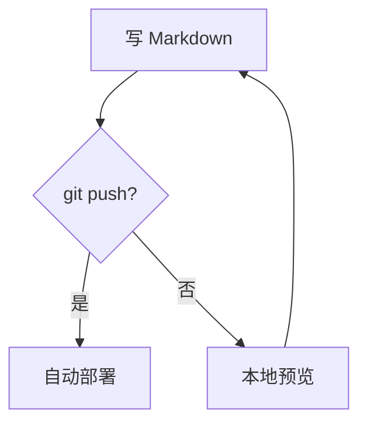

好，我已经收集到了足够的官方文档和真实资料。下面是完整的手把手教学。

---

# Zensical 从零到部署：手把手完整教学

---

## 第零章：全局流程图

```
安装 Python
    │
    ▼
创建虚拟环境
    │
    ▼
pip install zensical
    │
    ▼
zensical new my-blog     ←── 生成项目骨架
    │
    ▼
编辑 zensical.toml       ←── 唯一的配置文件
    │
    ▼
docs/ 下写 Markdown      ←── 你的日常工作
    │
    ▼
zensical serve           ←── 本地预览，改了即时刷新
    │
    ▼
git push                 ←── GitHub Actions 自动构建部署
    │
    ▼
https://你.github.io/你的仓库/   ←── 读者看到成品
```

---

## 第一章：本地环境安装

### 1.1 前置要求

你需要 Python 3.8+。打开终端确认：

```bash
python3 --version
# 输出类似：Python 3.11.9
```

没有 Python？去 [python.org](https://python.org) 下载安装，勾选「Add to PATH」。

### 1.2 创建虚拟环境（隔离依赖，强烈推荐）

Zensical 以 Python 包形式发布，推荐使用 Python 虚拟环境通过 pip 安装。

**macOS / Linux：**

```bash
# 选一个你放项目的地方
cd ~/Projects

# 创建虚拟环境（只需执行一次）
python3 -m venv .venv

# 激活虚拟环境（每次打开新终端都要执行）
source .venv/bin/activate

# 提示符前面出现 (.venv) 说明激活成功
```

**Windows（CMD）：**

```cmd
python -m venv .venv
.venv\Scripts\activate
```

**Windows（PowerShell）：**

```powershell
python -m venv .venv
.venv\Scripts\Activate.ps1
```

### 1.3 安装 Zensical

```bash
pip install zensical
```

验证安装：

```bash
zensical --version
# 输出类似：zensical, version 0.0.51
```

> **可选：用 uv 安装（更快）**
> 如果你已有 uv（Rust 写的 Python 包管理器）：
> ```bash
> uv pip install zensical
> ```

---

## 第二章：创建你的第一个项目

### 2.1 初始化项目

```bash
# 进入你想放博客的目录
cd ~/Projects

# 创建新项目（my-blog 换成你喜欢的名字）
zensical new my-blog

# 进入项目
cd my-blog
```

这会生成一个基础项目结构，包含 `zensical.toml` 配置文件和用于放内容的 `docs/` 目录。

### 2.2 生成的文件结构

```
my-blog/
├── zensical.toml      ← 唯一的配置文件（TOML 格式）
├── docs/
│   └── index.md       ← 网站首页
└── requirements.txt   ← 依赖锁定（用于 CI/CD）
```

### 2.3 立即预览

```bash
zensical serve
```

Zensical 包含一个内置 web 服务器，让你在写作时预览文档站点。服务器会在你修改源文件时自动重新构建站点。

打开浏览器访问 `http://localhost:8000`，你的站点已经出现了。

---

## 第三章：配置文件深度详解

`zensical.toml` 是所有站点配置的所在地，位于项目根目录，使用 TOML 语法。

下面是一份**完整注释版**配置文件，覆盖你所有的核心需求：

```toml
# ============================================================
# 项目基础信息
# ============================================================
[project]
site_name    = "我的知识库"                          # 必填，站点标题
site_url     = "https://你.github.io/my-blog/"     # 强烈推荐填写，搜索等功能依赖它
site_description = "我的个人博客与笔记"
site_author  = "你的名字"
copyright    = "Copyright &copy; 2026 你的名字"

# 在页面右上角显示 GitHub 链接
repo_url     = "https://github.com/你/my-blog"
repo_name    = "你/my-blog"

# ============================================================
# 主题设置
# ============================================================
[project.theme]
language = "zh"          # 界面语言：中文
# variant = "classic"    # 取消注释使用经典 Material 外观
                         # 默认 "modern" 是全新设计

# 明暗主题切换（跟随系统 + 手动切换）
[[project.theme.palette]]
media  = "(prefers-color-scheme)"
toggle.icon = "lucide/sun-moon"
toggle.name = "切换到亮色模式"

[[project.theme.palette]]
media  = "(prefers-color-scheme: light)"
scheme = "default"
toggle.icon = "lucide/sun"
toggle.name = "切换到暗色模式"

[[project.theme.palette]]
media  = "(prefers-color-scheme: dark)"
scheme = "slate"
toggle.icon = "lucide/moon"
toggle.name = "切换到亮色模式"

# ============================================================
# 功能特性开关（按需取消注释）
# ============================================================
[project.theme]
features = [
    # --- 导航体验 ---
    "navigation.instant",           # SPA 式导航，页面切换无刷新
    "navigation.instant.prefetch",  # 悬停链接时预加载，感知更快
    "navigation.instant.progress",  # 慢网络时显示顶部进度条
    "navigation.tabs",              # 顶部标签页（一级目录）
    "navigation.sections",          # 侧边栏分组标题
    "navigation.expand",            # 侧边栏自动展开
    "navigation.path",              # 面包屑导航
    "navigation.indexes",           # 目录可以有自己的 index.md
    "navigation.top",               # 滚动时显示「回到顶部」按钮
    "navigation.footer",            # 页面底部上一页/下一页

    # --- 搜索体验 ---
    "search.suggest",               # 搜索自动补全建议
    "search.highlight",             # 搜索结果高亮
    "search.share",                 # 搜索结果可分享链接

    # --- 内容体验 ---
    "content.code.copy",            # 代码块右上角复制按钮
    "content.code.annotate",        # 代码注释（悬浮提示）
    "content.tabs.link",            # 内容标签页联动（全站同步选中）
    "content.footnote.tooltips",    # 脚注鼠标悬浮显示
    "content.tooltips",             # 缩略词悬浮注释（abbr 扩展）

    # --- 目录体验 ---
    "toc.follow",                   # 右侧目录跟随滚动高亮
    "toc.integrate",                # 把目录整合进左侧导航栏
]

# ============================================================
# 导航结构（可选！不填则自动从文件夹生成）
# ============================================================
# 不定义 nav，Zensical 自动扫描 docs/ 按字母顺序生成导航
# 想控制顺序和标题时才需要填写：

# nav = [
#   { "首页" = "index.md" },
#   { "笔记" = [
#       { "数学" = [
#           { "微积分" = "notes/math/calculus.md" },
#       ]},
#       { "计算机科学" = [
#           { "算法" = "notes/cs/algorithms.md" },
#       ]},
#   ]},
#   { "博客" = [
#       { "文章一" = "blog/post-1.md" },
#   ]},
# ]

# ============================================================
# Markdown 扩展（完整版）
# ============================================================
[project.markdown_extensions]
# 标准扩展
extensions = [
    "abbr",             # 缩略词 → 悬浮注释
    "admonition",       # !!! note/warning/tip 提示框
    "attr_list",        # 为元素添加 HTML 属性
    "def_list",         # 定义列表
    "footnotes",        # 脚注
    "md_in_html",       # HTML 块内部渲染 Markdown
    "tables",           # 标准表格
    "toc",              # 自动目录，permalink 锚点
]

# PyMdownX 高级扩展
[project.markdown_extensions.pymdownx]
highlight  = { anchor_linenums = true, line_spans = "__span", pygments_lang_class = true }
inlinehilite = {}       # 行内代码高亮 `#!python print()`
superfences  = {}       # 嵌套代码块、Mermaid 图表
tabbed       = { alternate_style = true }  # 内容标签页
tasklist     = { custom_checkbox = true }  # 任务列表 - [ ] / - [x]
details      = {}       # 可折叠块 ???
emoji        = {}       # 表情符号 :smile:
arithmatex   = { generic = true }          # LaTeX 数学公式
snippets     = {}       # 文件片段引用
critic       = {}       # 修订标记
keys         = {}       # 键盘按键显示 ++ctrl+c++
mark         = {}       # 高亮文本 ==高亮==
smartsymbols = {}       # 智能符号
tilde        = {}       # 删除线 ~~文本~~
```

---

## 第四章：目录结构与 Markdown 写作

### 4.1 推荐的目录结构

如果你决定不定义导航，Zensical 会直接从你的 `docs_dir` 的目录结构派生导航结构。

```
my-blog/
├── zensical.toml
├── requirements.txt
└── docs/
    ├── index.md              ← 网站首页（必须有）
    │
    ├── blog/                 ← 博客板块
    │   ├── index.md          ← 博客分区首页
    │   ├── 2026-01-first-post.md
    │   └── 2026-02-second-post.md
    │
    ├── notes/                ← 笔记板块
    │   ├── index.md
    │   ├── math/
    │   │   ├── index.md
    │   │   ├── calculus.md
    │   │   └── linear-algebra.md
    │   └── cs/
    │       ├── index.md
    │       ├── algorithms.md
    │       └── networks.md
    │
    ├── projects/             ← 项目板块
    │   └── project-a.md
    │
    └── assets/               ← 静态资源
        ├── images/
        │   └── logo.png
        └── stylesheets/
            └── extra.css     ← 自定义样式（可选）
```

> **命名技巧**：文件名前加数字可控制字母排序顺序，如 `01-intro.md`、`02-setup.md`，Zensical 自动按序生成导航。

### 4.2 首页模板（`docs/index.md`）

```markdown
---
# Front Matter：页面元数据
title: 欢迎来到我的知识库
description: 这里记录我的学习笔记、技术博客和项目文档
hide:
  - navigation   # 首页可隐藏侧边栏
  - toc          # 首页可隐藏右侧目录
---

# 👋 欢迎

这里是我的个人知识库，包含以下内容：

<div class="grid cards" markdown>

- :fontawesome-solid-book: **学习笔记**

    ---
    数学、计算机科学等各类学习记录

    [:octicons-arrow-right-24: 查看笔记](notes/index.md)

- :fontawesome-solid-blog: **技术博客**

    ---
    技术文章、踩坑记录和项目总结

    [:octicons-arrow-right-24: 查看博客](blog/index.md)

</div>
```

### 4.3 普通页面模板（如 `docs/notes/math/calculus.md`）

```markdown
---
title: 微积分笔记
description: 极限、导数、积分的核心概念总结
tags:
  - 数学
  - 微积分
---

# 微积分

## 极限

极限是微积分的基础概念。

!!! note "核心定义"
    若对任意 $\varepsilon > 0$，存在 $\delta > 0$，使得当 $0 < |x - a| < \delta$ 时，
    有 $|f(x) - L| < \varepsilon$，则称 $L$ 为 $f(x)$ 在 $x \to a$ 时的极限。

## 导数

### 定义

$$
f'(x) = \lim_{h \to 0} \frac{f(x+h) - f(x)}{h}
$$

### 常用求导公式

| 函数 | 导数 |
|------|------|
| $x^n$ | $nx^{n-1}$ |
| $e^x$ | $e^x$ |
| $\ln x$ | $1/x$ |
| $\sin x$ | $\cos x$ |

## 代码示例（用 Python 计算导数）

```python  hl_lines="3 4"
import sympy as sp

x = sp.Symbol('x')
f = x**3 + 2*x**2 + x

# 求导
f_prime = sp.diff(f, x)
print(f_prime)  # (1)!
```

1. 输出：`3*x**2 + 4*x + 1`，即 $3x^2 + 4x + 1$

## 任务清单

- [x] 理解极限定义
- [x] 掌握求导公式
- [ ] 完成积分部分
```

### 4.4 Markdown 高级语法速查

#### 提示框（Admonitions）

```markdown
!!! note "笔记"
    这是一条笔记内容。

!!! warning "警告"
    这是一条警告。

!!! tip "技巧"
    这是一个实用技巧。

??? info "点击展开"
    这是可折叠的内容块。
```

#### 内容标签页

```markdown
=== "Python"
    ```python
    print("Hello, World!")
    ```

=== "JavaScript"
    ```javascript
    console.log("Hello, World!");
    ```

=== "Rust"
    ```rust
    println!("Hello, World!");
    ```
```

#### 悬浮注释（缩略词）

```markdown
*[API]: Application Programming Interface
*[HTML]: HyperText Markup Language

这段文字中的 API 和 HTML 鼠标悬停时会显示全称。
```

#### Mermaid 流程图

````markdown

````

#### 数学公式

```markdown
行内公式：$E = mc^2$

块级公式：

$$
\int_{-\infty}^{\infty} e^{-x^2} dx = \sqrt{\pi}
$$
```

---

## 第五章：本地开发工作流

### 5.1 日常三条命令

```bash
# 1. 激活虚拟环境（每次新开终端）
source .venv/bin/activate   # macOS/Linux
# .venv\Scripts\activate    # Windows

# 2. 启动本地预览服务器
zensical serve
# → 自动打开 http://localhost:8000
# → 保存任何 .md 文件，浏览器立即刷新

# 3. 手动构建静态文件（可选，CI 会自动做）
zensical build
# → 生成 site/ 目录，里面是完整的静态网站
```

### 5.2 serve 命令的进阶参数

```bash
# 指定端口（默认 8000）
zensical serve --dev-addr 127.0.0.1:8080

# 在 Docker 或远程服务器中用（监听所有网卡）
zensical serve -a 0.0.0.0:8000

# 构建后立即退出（不启动服务器）
zensical build --output site
```

### 5.3 目录预览效果

```
保存 docs/notes/math/calculus.md
        ↓  （约 100-300ms）
浏览器自动刷新，立即看到最新内容
```

---

## 第六章：GitHub 仓库设置

### 6.1 初始化 Git 仓库

```bash
# 在 my-blog 目录内
git init

# 创建 .gitignore
cat > .gitignore << 'EOF'
# Zensical 构建输出（CI 会重新生成）
site/

# Python 虚拟环境（本地用，不需要上传）
.venv/
__pycache__/
*.pyc

# 系统文件
.DS_Store
Thumbs.db

# 编辑器配置（可选保留）
.vscode/
EOF

git add .
git commit -m "初始化 Zensical 博客项目"
```

### 6.2 在 GitHub 创建仓库

1. 打开 [github.com/new](https://github.com/new)
2. Repository name 填 `my-blog`（或任意名称）
3. 选 **Public**（GitHub Pages 免费用）
4. **不要**勾选 Initialize README（我们已经有内容了）
5. 点击 **Create repository**

### 6.3 推送代码到 GitHub

```bash
git remote add origin https://github.com/你的用户名/my-blog.git
git branch -M main
git push -u origin main
```

---

## 第七章：GitHub Actions 自动部署（核心）

这是整个方案的灵魂：**你 push，它自动构建部署**。

### 7.1 创建 workflow 文件

```bash
mkdir -p .github/workflows
```

创建文件 `.github/workflows/deploy.yml`：

这个配置包含了使用 GitHub Actions 自动部署到 GitHub Pages 的完整设置，每次向 main 分支推送都会自动构建并部署你的站点。

```yaml
name: 部署 Zensical 博客到 GitHub Pages

on:
  push:
    branches:
      - main        # 推送到 main 分支时触发
  workflow_dispatch: # 也允许手动触发

permissions:
  contents: read
  pages: write
  id-token: write

# 同时只运行一个部署，防止并发冲突
concurrency:
  group: "pages"
  cancel-in-progress: false

jobs:
  build:
    name: 构建站点
    runs-on: ubuntu-latest
    steps:
      - name: 检出代码
        uses: actions/checkout@v4
        with:
          fetch-depth: 0   # 获取完整历史（用于 git 修改时间功能）

      - name: 配置 Python
        uses: actions/setup-python@v5
        with:
          python-version: '3.x'

      - name: 安装 Zensical
        run: pip install zensical

      - name: 构建静态站点
        run: zensical build

      - name: 上传构建产物
        uses: actions/upload-pages-artifact@v3
        with:
          path: ./site   # Zensical 默认输出到 site/ 目录

  deploy:
    name: 部署到 GitHub Pages
    needs: build         # 等 build job 完成后才运行
    runs-on: ubuntu-latest
    environment:
      name: github-pages
      url: ${{ steps.deployment.outputs.page_url }}
    steps:
      - name: 部署到 GitHub Pages
        id: deployment
        uses: actions/deploy-pages@v4
```

### 7.2 在 GitHub 仓库开启 Pages

1. 打开你的 GitHub 仓库
2. 点击 **Settings**（设置）
3. 左侧菜单找到 **Pages**
4. Source 选择 **GitHub Actions**（不是 Deploy from a branch）
5. 保存

### 7.3 推送触发第一次部署

```bash
git add .github/workflows/deploy.yml
git commit -m "添加 GitHub Actions 自动部署"
git push
```

然后去 GitHub 仓库的 **Actions** 标签页，可以看到流水线正在运行。约 1-3 分钟后，访问 `https://你的用户名.github.io/my-blog/` 即可看到你的站点，之后每次更新 `docs/` 或 `zensical.toml`，GitHub Actions 都会自动重新部署。

---

## 第八章：锁定依赖版本（生产必备）

为了确保每次 CI 构建结果一致，锁定 Zensical 版本：

```bash
# 生成 requirements.txt
pip freeze | grep zensical > requirements.txt

# 查看内容
cat requirements.txt
# 输出类似：zensical==0.0.51
```

然后修改 `deploy.yml` 中的安装步骤：

```yaml
      - name: 安装 Zensical（固定版本）
        run: pip install -r requirements.txt
```

升级时：

```bash
pip install --upgrade zensical
pip freeze | grep zensical > requirements.txt
git add requirements.txt
git commit -m "升级 Zensical 到最新版"
git push
```

---

## 第九章：日常写作完整流程

### 9.1 你每天实际要做的事

```bash
# 第一步：激活环境（新开终端时）
source .venv/bin/activate

# 第二步：启动预览服务器
zensical serve

# 第三步：在 docs/ 下创建或编辑 .md 文件
# （用任何你喜欢的编辑器，如 VSCode、Obsidian、Typora）

# 第四步：浏览器里实时看效果

# 第五步：满意后提交推送
git add .
git commit -m "添加：微积分笔记第三章"
git push

# ✅ 完成！3分钟内网站自动更新
```

### 9.2 添加新页面的流程

```bash
# 1. 创建新文件（文件夹不存在会自动创建）
mkdir -p docs/notes/physics
touch docs/notes/physics/mechanics.md

# 2. 写内容（在编辑器里打开写就行）

# 3. 如果你开启了自动导航：什么都不用配置，直接 push 即可
# 4. 如果你手动配置了 nav：在 zensical.toml 的 nav 里加一行

# 5. push 触发自动部署
git add docs/notes/physics/mechanics.md
git commit -m "新增：物理力学笔记"
git push
```

### 9.3 推荐的 VSCode 设置

安装以下插件获得最佳写作体验：

| 插件名 | 作用 |
|--------|------|
| **Markdown All in One** | Markdown 快捷键、预览、目录生成 |
| **Markdown Preview Enhanced** | 支持 Mermaid、LaTeX 的增强预览 |
| **Paste Image** | 截图直接粘贴到 Markdown |
| **GitLens** | 查看每行文字的 git 历史 |

---

## 第十章：备选部署方案对比

生成的站点可以部署到 GitHub Pages、你选择的 CDN，或者你的私有网络空间。

| 方案 | 费用 | 难度 | 适合场景 | 配置要点 |
|------|------|------|----------|----------|
| **GitHub Pages** | 免费 | ⭐ 最低 | 个人博客、开源项目 | 本文方案，改 workflow 即可 |
| **Cloudflare Pages** | 免费（更慷慨的限额） | ⭐⭐ 低 | 想要更快的 CDN | 连接 GitHub 仓库，一键配置 |
| **Netlify** | 免费（有额度限制） | ⭐⭐ 低 | 需要表单、重定向等功能 | 添加 `netlify.toml` |
| **Read the Docs** | 免费（开源项目） | ⭐⭐ 低 | 技术文档项目 | 添加 `.readthedocs.yaml` |
| **自己的服务器** | 有成本 | ⭐⭐⭐ 中 | 完全控制、私有部署 | Nginx 托管 `site/` 目录 |

### Cloudflare Pages 部署（推荐备选）

打开 Cloudflare Dashboard → Compute → Workers & Pages → 点击 Import a Repository → 连接 GitHub 账号 → 选择仓库 → 输入项目名 → 其他设置保持默认 → 点击 Create and Deploy。

### Read the Docs 部署配置

在项目根目录添加 `.readthedocs.yaml`，最小配置如下：

```yaml
version: 2
build:
  os: ubuntu-24.04
  tools:
    python: latest
  jobs:
    install:
      - pip install zensical
    build:
      html:
        - zensical build
    post_build:
      - mkdir -p $READTHEDOCS_OUTPUT/html/
      - cp --recursive site/* $READTHEDOCS_OUTPUT/html/
```

---

## 第十一章：常见问题与排错

### Q1：`zensical: command not found`

```bash
# 原因：虚拟环境没有激活
source .venv/bin/activate
# 再试一次
zensical serve
```

### Q2：中文搜索不生效

在 `zensical.toml` 确认：

```toml
[project.theme]
language = "zh"
```

### Q3：图片不显示

图片路径必须**相对于当前 Markdown 文件**：

```markdown
<!-- docs/notes/math/calculus.md 里引用图片 -->


<!-- 或者放在同目录下 -->

```

### Q4：数学公式不渲染

需要在 `zensical.toml` 开启 arithmatex 扩展，并添加 MathJax 脚本：

在 `docs/assets/javascripts/mathjax.js` 创建：

```javascript
window.MathJax = {
  tex: {
    inlineMath: [["\\(", "\\)"]],
    displayMath: [["\\[", "\\]"]],
    processEscapes: true,
  }
};
```

在 `zensical.toml` 添加：

```toml
extra_javascript = [
    "assets/javascripts/mathjax.js",
    "https://unpkg.com/mathjax@3/es5/tex-mml-chtml.js",
]
```

### Q5：GitHub Actions 失败

常见原因排查：

```
Error: No such file or directory: 'site/'
→ 检查 zensical build 是否成功，查看 Actions 日志

Error: HttpError: Not Found
→ 检查 Settings → Pages 是否设置为 GitHub Actions

Error: Resource not accessible by integration
→ 检查 workflow 中 permissions 是否正确设置
```

---

## 总结：你的完整知识图谱

```
安装
├── python3 -m venv .venv
├── source .venv/bin/activate
└── pip install zensical

创建项目
├── zensical new my-blog
└── 编辑 zensical.toml（一次性配置）

日常写作（循环）
├── zensical serve    ← 本地预览
├── 编辑 docs/*.md    ← 你的全部工作
└── git push          ← 触发自动部署

GitHub 设置（一次性）
├── 创建仓库
├── Settings → Pages → GitHub Actions
└── 添加 .github/workflows/deploy.yml

结果
└── https://你.github.io/my-blog/   ← 永远是最新内容
```

你只需要记住一件事：**写完 Markdown，`git push`，其余全自动。**